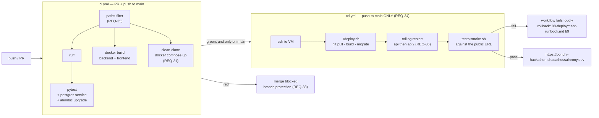

# 07 — Containerization

**Purpose:** the Dockerfiles, the compose file, and every container command we will need, with expected output.
**Read this when:** writing Docker config, or when you half-remember a command and are about to guess.
**Status:** **FINAL.** Dockerfiles and mechanics are problem-independent and unchanged; §3 (service
inventory) and §8 (pipeline) were rewritten against the real requirements.

Scoring: **Containerization & CI = 15 points**, and it is in the **second tie-break position** alongside Deployment (Rulebook §7.3). This file and `08-deployment-runbook.md` are worth more than any single feature.

> 🔴 **Two requirements govern this whole file and are easy to under-read:**
> **REQ-21** — *"`docker compose up` works from a clean clone with **no manual steps**"* — so `.env`
> cannot be required, and migrations and seeding cannot be a human step.
> **REQ-30** — *"must bring the whole stack up with **no external dependencies**"* — so the gateway
> container is part of our compose file, not something a judge is expected to start.
> Judges will `git clone` into an empty directory and type `docker compose up`. That path is tested
> by CI (§8).

---

## §1 — `backend/Dockerfile` — multi-stage

**REQ-62** (`rulebook.md` §8) — *"A working **Dockerfile per service** and a root
`docker-compose.yml`"*. We build two (`backend/`, `frontend/`); `db` and `gateway` are pinned
upstream images, which is the correct answer to "per service" — we do not build Postgres, and REQ-08
forbids us rebuilding the gateway.

Strategy: a builder stage with the toolchain, a slim runtime with only the virtualenv and app code, running as a non-root user.

```dockerfile
# ---------- stage 1: builder ----------
FROM python:3.12-slim AS builder

ENV PIP_NO_CACHE_DIR=1 \
    PIP_DISABLE_PIP_VERSION_CHECK=1 \
    PYTHONDONTWRITEBYTECODE=1

WORKDIR /build

# Build toolchain lives ONLY in this stage; it never reaches the runtime image.
RUN apt-get update && apt-get install -y --no-install-recommends build-essential \
    && rm -rf /var/lib/apt/lists/*

# Dependency manifest copied alone first -> this layer caches across every code change.
COPY pyproject.toml ./
RUN python -m venv /opt/venv \
    && /opt/venv/bin/pip install --upgrade pip \
    && /opt/venv/bin/pip install .          # runtime deps only; NOT ".[dev]"

# ---------- stage 2: runtime ----------
FROM python:3.12-slim AS runtime

ENV PATH="/opt/venv/bin:$PATH" \
    PYTHONUNBUFFERED=1 \
    PYTHONDONTWRITEBYTECODE=1 \
    PYTHONPATH=/app

# curl is required by the HEALTHCHECK below. Nothing else is installed.
RUN apt-get update && apt-get install -y --no-install-recommends curl \
    && rm -rf /var/lib/apt/lists/* \
    && groupadd -r appuser && useradd -r -g appuser -u 10001 appuser

WORKDIR /app
COPY --from=builder /opt/venv /opt/venv
COPY --chown=appuser:appuser alembic.ini ./
COPY --chown=appuser:appuser alembic/ ./alembic/
COPY --chown=appuser:appuser app/ ./app/

USER appuser                      # <-- non-root. Verified in §6.

EXPOSE 8000

HEALTHCHECK --interval=10s --timeout=3s --start-period=20s --retries=5 \
  CMD curl -fsS http://localhost:8000/health || exit 1

CMD ["uvicorn", "app.main:app", "--host", "0.0.0.0", "--port", "8000", "--workers", "2", "--proxy-headers", "--forwarded-allow-ips", "*"]
```

| Choice | Reason |
| :--- | :--- |
| `python:3.12-slim`, not `alpine` | musl breaks/slows Python wheels; `psycopg[binary]` and `bcrypt` install cleanly on slim. Alpine "saves" ~40 MB and costs 20 minutes of debugging. |
| venv copied from builder | Only installed packages cross the stage boundary — no pip cache, no `build-essential`, no `.pyc` from the build. |
| `pyproject.toml` copied before source | Layer cache: editing `app/` does not reinstall dependencies. Biggest single build-time win. |
| `pip install .` not `.[dev]` | pytest/ruff/httpx never enter the production image. |
| `USER appuser` (uid 10001) | Container escape does not land root. Scored under Deployment/Production Readiness, and a guaranteed judge question. |
| `--proxy-headers --forwarded-allow-ips "*"` | Nginx sets `X-Forwarded-Proto: https`; without this uvicorn builds `http://` URLs in redirects and `Location` headers. Safe because only Nginx on loopback can reach it. |
| `--workers 2` | Matches a 2-vCPU VM (Q-03). Re-tune after Scenario C, not before. ⚠️ Each worker runs its own sweeper and its own in-process rate limiter — both idempotent, both stated openly in `02-architecture.md` §5d. |
| `HEALTHCHECK` on `/health`, **never `/ready`** | REQ-18. `/health` touches nothing, so a Postgres or gateway blip cannot mark a healthy API unhealthy and trigger a restart loop. `11-observability.md` §4. |
| Pin `python:3.12-slim@sha256:...` | Do this **before code freeze** (`09-security-hardening.md`). Not during the build — a digest change mid-day costs a rebuild. |

`backend/.dockerignore` — **must** include `.env`:
```
.env
.env.*
.venv/
venv/
__pycache__/
*.pyc
.pytest_cache/
.mypy_cache/
.ruff_cache/
tests/
.git/
*.md
```
> `.env` in `.dockerignore` is a hard requirement. Without it, secrets get baked into an image layer and survive forever, even if the file is deleted in a later layer.

---

## §2 — `frontend/Dockerfile` — build stage producing static assets

The frontend does **not** run in production (ADR-004 / `06-frontend-plan.md` §6). This image exists so the build is reproducible in CI and on the VM without a host Node install.

```dockerfile
# ---------- stage 1: build ----------
FROM node:20-slim AS build

WORKDIR /app
COPY package*.json ./
RUN npm ci                      # ci, not install: uses the lockfile exactly, and is faster

COPY . .
RUN npm run build               # -> /app/dist

# ---------- stage 2: artifact carrier ----------
FROM busybox:1.36 AS artifact
COPY --from=build /app/dist /dist
CMD ["true"]
```

Extract the assets without running a server:

```bash
docker build -t cinemaseat-frontend:latest ./frontend
# expected: "naming to docker.io/library/cinemaseat-frontend:latest"

id=$(docker create cinemaseat-frontend:latest)
docker cp "$id:/dist/." ./frontend-dist/
docker rm "$id"
sudo rsync -a --delete ./frontend-dist/ /var/www/cinemaseat/
# expected: /var/www/cinemaseat/index.html exists
```

> **Simpler path if Node is on the VM:** `cd frontend && npm ci && npm run build && sudo rsync -a --delete dist/ /var/www/cinemaseat/`. Use whichever works; the Dockerfile still satisfies R-09 ("a working Dockerfile **per service**") and keeps CI able to build the frontend.

---

## §3 — `docker-compose.yml` (root — **one file, works on a clean clone and on the VM**)

Five services: `db`, `gateway`, `migrate` (one-shot), `api`, `api2`.

```yaml
name: cinemaseat

x-api-env: &api-env
  # Every value has a dev-safe default so `docker compose up` works with NO .env  (REQ-21).
  # A real .env at repo root overrides any of them; on the VM it supplies the real secrets.
  # This block MUST stay in sync with the table in 05-backend-plan.md §4.
  # NOTE: DATABASE_URL is deliberately absent — config.py assembles it from the parts
  #       below, so there is exactly one source of truth for the connection string.
  APP_NAME:               ${APP_NAME:-cinemaseat-api}
  APP_VERSION:            ${APP_VERSION:-0.1.0}
  ENVIRONMENT:            ${ENVIRONMENT:-local}
  LOG_LEVEL:              ${LOG_LEVEL:-INFO}
  PUBLIC_BASE_URL:        ${PUBLIC_BASE_URL:-http://localhost:8000}
  CORS_ORIGINS:           ${CORS_ORIGINS:-http://localhost:5173}
  # ---- database --------------------------------------------------------------
  POSTGRES_USER:          ${POSTGRES_USER:-cinemaseat}
  POSTGRES_PASSWORD:      ${POSTGRES_PASSWORD:-cinemaseat_dev_pw}
  POSTGRES_DB:            ${POSTGRES_DB:-cinemaseat}
  POSTGRES_HOST:          db
  POSTGRES_PORT:          5432
  DB_POOL_SIZE:           ${DB_POOL_SIZE:-10}
  DB_MAX_OVERFLOW:        ${DB_MAX_OVERFLOW:-10}
  DB_POOL_TIMEOUT:        ${DB_POOL_TIMEOUT:-10}
  # ---- REQ-19: judges override this and watch a hold expire -------------------
  HOLD_TTL_SECONDS:       ${HOLD_TTL_SECONDS:-120}
  PAYMENT_WINDOW_SECONDS: ${PAYMENT_WINDOW_SECONDS:-90}
  SWEEP_INTERVAL_SECONDS: ${SWEEP_INTERVAL_SECONDS:-5}
  RECONCILE_INTERVAL_SECONDS: ${RECONCILE_INTERVAL_SECONDS:-30}
  MAX_SEATS_PER_HOLD:     ${MAX_SEATS_PER_HOLD:-6}
  # ---- REQ-08: the provided gateway, reachable by service name ----------------
  GATEWAY_BASE_URL:       http://gateway:9000
  GATEWAY_CALLBACK_URL:   ${GATEWAY_CALLBACK_URL:-http://api:8000/payments/callback}
  GATEWAY_TIMEOUT_SECONDS:        ${GATEWAY_TIMEOUT_SECONDS:-5.0}
  GATEWAY_HEALTH_TIMEOUT_SECONDS: ${GATEWAY_HEALTH_TIMEOUT_SECONDS:-1.0}
  GATEWAY_BREAKER_THRESHOLD:      ${GATEWAY_BREAKER_THRESHOLD:-5}
  GATEWAY_BREAKER_RESET_SECONDS:  ${GATEWAY_BREAKER_RESET_SECONDS:-30}
  # ---- OTP (Q-05: OTP_REQUIRED is the escape hatch, never flipped silently) ---
  OTP_REQUIRED:               ${OTP_REQUIRED:-true}
  OTP_MAX_ATTEMPTS:           ${OTP_MAX_ATTEMPTS:-5}
  OTP_RESEND_COOLDOWN_SECONDS: ${OTP_RESEND_COOLDOWN_SECONDS:-30}
  # ---- rate limiting (INF-09) ------------------------------------------------
  # ⚠️ RATE_LIMIT_HOLD_PER_MINUTE must NOT shed Scenario A's 100-request burst.
  RATE_LIMIT_HOLD_PER_MINUTE:    ${RATE_LIMIT_HOLD_PER_MINUTE:-120}
  RATE_LIMIT_DEFAULT_PER_MINUTE: ${RATE_LIMIT_DEFAULT_PER_MINUTE:-600}
  SESSION_SECRET:         ${SESSION_SECRET:-dev-only-not-a-secret}

services:

  db:
    image: postgres:16-alpine
    restart: unless-stopped
    environment:
      POSTGRES_USER:     ${POSTGRES_USER:-cinemaseat}
      POSTGRES_PASSWORD: ${POSTGRES_PASSWORD:-cinemaseat_dev_pw}
      POSTGRES_DB:       ${POSTGRES_DB:-cinemaseat}
      PGDATA: /var/lib/postgresql/data/pgdata
    volumes:
      - pgdata:/var/lib/postgresql/data
    networks: [appnet]
    # NO ports: — Postgres is never reachable from the host or the internet (02-architecture.md §5c)
    healthcheck:
      test: ["CMD-SHELL", "pg_isready -U $${POSTGRES_USER} -d $${POSTGRES_DB}"]
      interval: 5s
      timeout: 3s
      retries: 10
      start_period: 10s
    security_opt: [ "no-new-privileges:true" ]

  # ---- REQ-08 / REQ-11: the PROVIDED gateway. We do not mock it. ---------------
  gateway:
    image: asifmahmoud414/mock-gateway:latest
    restart: unless-stopped
    ports:
      - "127.0.0.1:9000:9000"    # loopback only: handy locally, unreachable from the internet
    networks: [appnet]
    healthcheck:
      test: ["CMD-SHELL", "wget -qO- http://localhost:9000/health || exit 1"]
      interval: 10s
      timeout: 3s
      retries: 5
      start_period: 10s

  # ---- REQ-21: migrations + seed run automatically, ONCE, and then exit --------
  migrate:
    build: { context: ./backend, dockerfile: Dockerfile, target: runtime }
    environment: *api-env
    depends_on:
      db: { condition: service_healthy }
    networks: [appnet]
    restart: "no"
    command: ["sh", "-c", "alembic upgrade head && python -m app.seed"]

  api:
    build: { context: ./backend, dockerfile: Dockerfile, target: runtime }
    restart: unless-stopped
    environment: *api-env
    depends_on:
      db:      { condition: service_healthy }
      gateway: { condition: service_started }          # NOT service_healthy — see note below
      migrate: { condition: service_completed_successfully }
    ports:
      - "127.0.0.1:8000:8000"     # LOOPBACK ONLY. Nginx proxies here. Never 0.0.0.0.
    networks: [appnet]
    healthcheck:
      test: ["CMD", "curl", "-fsS", "http://localhost:8000/health"]
      interval: 10s
      timeout: 3s
      retries: 5
      start_period: 15s
    security_opt: [ "no-new-privileges:true" ]
    logging:
      driver: json-file
      options: { max-size: "10m", max-file: "3" }

  # ---- REQ-47 (Nginx load balancing) + REQ-36 (reachable during deploy) --------
  api2:
    build: { context: ./backend, dockerfile: Dockerfile, target: runtime }
    restart: unless-stopped
    environment: *api-env
    depends_on:
      db:      { condition: service_healthy }
      migrate: { condition: service_completed_successfully }
    ports:
      - "127.0.0.1:8001:8000"
    networks: [appnet]
    healthcheck:
      test: ["CMD", "curl", "-fsS", "http://localhost:8000/health"]
      interval: 10s
      timeout: 3s
      retries: 5
      start_period: 15s
    security_opt: [ "no-new-privileges:true" ]
    logging:
      driver: json-file
      options: { max-size: "10m", max-file: "3" }

volumes:
  pgdata:
    name: cinemaseat_pgdata

networks:
  appnet:
    driver: bridge
```

### Service-by-service

| Service | Why it exists | Published? | `depends_on` |
| :--- | :--- | :--- | :--- |
| `db` | INF-01 — persistence must survive a restart | **nothing** | — |
| `gateway` | **REQ-08, REQ-11.** *"Do not mock this yourself."* REQ-30 says the stack must come up with no external dependencies, so it is ours to run. | `127.0.0.1:9000` | — |
| `migrate` | **REQ-21 + REQ-10.** Runs `alembic upgrade head && python -m app.seed`, then exits 0. | no | `db: service_healthy` |
| `api` | The application | `127.0.0.1:8000` | `db`, `gateway`, `migrate` |
| `api2` | **REQ-47** (a real Nginx upstream needs two backends) + **REQ-36** (restart one at a time and stay reachable) | `127.0.0.1:8001` | `db`, `migrate` |

### The five decisions in that file worth defending

| Decision | Reason |
| :--- | :--- |
| **`${VAR:-default}` everywhere, no `env_file:`** | REQ-21: a clean clone has no `.env`, and `env_file: .env` would make compose fail outright. With substitution defaults the stack boots; a real `.env` at repo root still overrides everything. **This is the line between "judges type one command" and "judges file a bug".** |
| **`migrate` as a one-shot with `service_completed_successfully`** | Satisfies REQ-21 without auto-migrating in the API entrypoint. A failed migration blocks the API from starting **and leaves a readable exited container** — instead of a restart loop with no API to debug through. `03-data-model.md` §5.5. |
| **`gateway` uses `service_started`, not `service_healthy`** | REQ-18/REQ-44: the API must start and serve `/health` **even when the gateway is broken**. Gating startup on gateway health would make a bonus-scored fault-isolation property impossible to demonstrate. |
| **`api2` exists at all** | REQ-47 asks for load balancing. An `upstream` block with one server is a diagram, not load balancing. Two replicas also give REQ-36 a real answer: restart one, Nginx drains to the other. Cost: two entries in the compose file. |
| **`db` has no `ports:` key at all** | Even a leaked password is unusable from outside. Verified externally in `08-deployment-runbook.md` §1. |

> ⚠️ **Consequence of `api2`, stated up front:** the in-process rate limiter and the expiry sweeper
> now run in 2 replicas × 2 workers = **4 processes**. The sweeper statement is idempotent so this
> is wasteful, not wrong. The rate limiter becomes **per-process**, i.e. the effective limit is 4×
> the configured value. Both are ADR-008 consequences and both are better said out loud than
> discovered by a judge.

**`$${POSTGRES_USER}` (double dollar) in the healthcheck is deliberate** — it escapes compose's own
substitution so the shell *inside the container* expands it. `${...}` there would be interpolated at
parse time and produce an empty string.

### `docker-compose.override.yml` (local dev only — **never** copied to the VM)

Compose auto-loads this file when present. Its absence on the VM is what makes the same
`docker-compose.yml` production-safe.

```yaml
services:
  db:
    ports: [ "127.0.0.1:5433:5432" ]    # local psql/DBeaver; 5433 avoids a host Postgres clash
  api:
    volumes:
      - ./backend/app:/app/app          # hot reload
      - ./backend/alembic:/app/alembic
    environment:
      ENVIRONMENT: local
      LOG_LEVEL: DEBUG
    command: ["uvicorn", "app.main:app", "--host", "0.0.0.0", "--port", "8000", "--reload"]
  api2:
    profiles: ["lb"]                    # single replica locally unless you ask for it
```

🔴 **On the VM: `docker-compose.override.yml` must not exist.**
```bash
ls docker-compose.override.yml 2>/dev/null && echo "DANGER: override present on VM — remove it"
# expected on VM: no output
docker compose config | grep -E 'ports:|--reload' -A2
# expected: 127.0.0.1:8000, 127.0.0.1:8001, 127.0.0.1:9000 only. No 5433. No --reload.
```
`docker compose config` renders the fully-merged file. **Run it on the VM before every deploy** —
it is the one command that shows what will actually run.

### 🔴 The clean-clone test — run it yourself before you believe REQ-21

Judges will do exactly this. CI does it too (§8).
```bash
cd /tmp && rm -rf clean-clone && git clone https://github.com/<org>/<repo>.git clean-clone
cd clean-clone && ls -la .env            # expected: No such file  <-- the whole point
docker compose up -d
# expected: db healthy -> migrate Exited (0) -> api, api2 healthy -> gateway healthy
docker compose ps -a
curl -fsS localhost:8000/health          # expected: {"status":"ok",...}
curl -fsS localhost:8000/movies          # expected: a seeded catalogue, NOT an empty list
curl -fsS localhost:8000/shows/1/seats | head -c 200
docker compose down                      # NOT -v
```
**If any line needs a human step, REQ-21 is failed** and one of the four judging hooks is gone.

---

## §4 — Postgres volume, backup, restore

```bash
docker volume ls | grep pgdata
# expected: local     cinemaseat_pgdata

docker volume inspect cinemaseat_pgdata --format '{{.Mountpoint}}'
# expected: /var/lib/docker/volumes/cinemaseat_pgdata/_data
```

**Backup (run before the demo, and before any risky change):**
```bash
docker compose exec -T db pg_dump -U "$POSTGRES_USER" -d "$POSTGRES_DB" \
  | gzip > "backup-$(date +%F-%H%M).sql.gz"
# expected: a non-trivial .gz file
ls -lh backup-*.sql.gz     # sanity: NOT 20 bytes
```

**Restore:**
```bash
gunzip -c backup-2026-08-08-1700.sql.gz \
  | docker compose exec -T db psql -U "$POSTGRES_USER" -d "$POSTGRES_DB"
# expected: CREATE TABLE / COPY / ALTER TABLE lines, no ERROR
```

**Full-volume snapshot (belt and braces, before anything scary):**
```bash
docker run --rm -v cinemaseat_pgdata:/data -v "$PWD":/backup alpine \
  tar czf /backup/pgdata-$(date +%F-%H%M).tar.gz -C /data .
```

🔴 **The one command that destroys the demo:**
```bash
docker compose down -v          # -v DELETES the named volume. All data gone.
```
**Never type `-v`.** Tear down with plain `docker compose down`. If muscle memory is a risk, use `make down`, which is defined without it.

---

## §5 — Commands (the full working set)

```bash
# --- build / run -----------------------------------------------------------
docker compose build                       # expected: "Successfully built" / "naming to ..."
docker compose build --no-cache api        # when a dep change is not being picked up
docker compose up -d --build               # expected: db Healthy -> migrate Exited(0) -> api/api2 Started
docker compose ps -a                       # expected: db, gateway, api, api2 (healthy); migrate Exited (0)
docker compose logs migrate                # expected: the alembic upgrade lines + the seed summary

# --- logs ------------------------------------------------------------------
docker compose logs -f api                 # follow
docker compose logs --tail=100 api         # last 100 — the FIRST thing to run on any failure
docker compose logs --since 5m api | grep -i error
docker compose logs api | grep <request-id>   # one request end to end (11-observability.md)

# --- exec ------------------------------------------------------------------
docker compose exec api bash                              # shell (as appuser, non-root)
docker compose exec api python -c "from app.core.config import get_settings; print(get_settings().model_dump(exclude={'secret_key','postgres_password'}))"
docker compose exec db psql -U "$POSTGRES_USER" -d "$POSTGRES_DB"      # \dt  \d users  \q
docker compose exec api env | grep -E 'POSTGRES_HOST|ENVIRONMENT|HOLD_TTL_SECONDS|GATEWAY_BASE_URL'

# --- gateway (REQ-08) ------------------------------------------------------
docker compose logs -f gateway                            # watch charges + callbacks land
curl -s localhost:9000/health                             # expected: 200
docker compose stop gateway                               # REQ-44 fault-isolation drill
curl -s localhost:8000/health                             # expected: STILL 200
docker compose start gateway

# --- migrations (ALWAYS inside a container) --------------------------------
docker compose exec api alembic heads                     # expected: exactly ONE (head)
docker compose exec api alembic current
docker compose exec api alembic revision --autogenerate -m "msg"
docker compose exec api alembic upgrade head              # expected: "Running upgrade X -> Y"
docker compose exec api alembic downgrade -1              # emergency only
docker compose exec api python -m app.seed                # idempotent

# --- teardown --------------------------------------------------------------
docker compose stop                        # pause, keeps containers and data
docker compose down                        # remove containers+network, KEEPS the pgdata volume  <-- use this
docker compose restart api                 # after an env change that needs no rebuild
# docker compose down -v                   # NEVER. Deletes the database.

# --- inspection ------------------------------------------------------------
docker compose config                      # merged config — what will ACTUALLY run
docker stats --no-stream                   # CPU/MEM per container (10-testing-and-load.md)
docker image ls | grep hackathon           # image sizes
docker system df                           # disk usage — check before a big rebuild
```

**Makefile** (thin wrappers so nobody types `-v` at 18:00):

| Target | Command |
| :--- | :--- |
| `make up` | `docker compose up -d --build` |
| `make down` | `docker compose down` *(never `-v`)* |
| `make logs` | `docker compose logs -f api` |
| `make ps` | `docker compose ps` |
| `make migrate` | `docker compose exec api alembic upgrade head` |
| `make heads` | `docker compose exec api alembic heads` |
| `make seed` | `docker compose exec api python -m app.seed` |
| `make sh` | `docker compose exec api bash` |
| `make psql` | `docker compose exec db psql -U $$POSTGRES_USER -d $$POSTGRES_DB` |
| `make test` | `docker compose exec api pytest -q` |
| `make smoke` | `bash tests/smoke.sh` |
| `make backup` | the `pg_dump` line from §4 |
| `make gateway-down` | `docker compose stop gateway` — the REQ-44 drill |
| `make gateway-up` | `docker compose start gateway` |
| `make scenario-a` | `k6 run --env SCENARIO=oversell tests/load/k6-load.js` (**from a laptop**, REQ-42) |
| `make scenario-b` | short-TTL restart + the timed expiry sequence (`10-testing-and-load.md` §5) |
| `make clean-clone` | the REQ-21 verification from §3, into `/tmp` |

---

## §6 — Verification checklist (run once after the Dockerfiles are written)

```bash
docker compose exec api whoami
# expected: appuser        <-- NOT root

docker image ls cinemaseat-api --format '{{.Size}}'
# expected: ~200-300 MB. Over 600 MB means dev deps or build tools leaked into runtime.

docker compose exec api pip list 2>/dev/null | grep -E 'pytest|ruff|httpx'
# expected: NO output — dev deps are absent from the runtime image

docker history cinemaseat-api:latest | head -15
# expected: no layer referencing .env or a secret

docker compose exec api ls -la /app | grep -c '\.env'
# expected: 0 — .env is never copied into the image

ss -tlnp | grep -E ':(5432|8000|8001|9000)'
# expected: 8000, 8001, 9000 bound to 127.0.0.1 ONLY. 5432 must NOT appear at all.

# REQ-19: the TTL really does come from the environment, end to end
HOLD_TTL_SECONDS=15 docker compose up -d api
curl -s localhost:8000/shows/1/seats | python3 -c 'import json,sys;print(json.load(sys.stdin)["hold_ttl_seconds"])'
# expected: 15        <-- if this prints 120, it is hardcoded somewhere and REQ-19 is failed
docker compose up -d api   # back to the default

# REQ-18: liveness is independent of the gateway
docker compose stop gateway && curl -s -w ' %{http_code} %{time_total}s\n' -o /dev/null localhost:8000/health
# expected: 200 and well under 1s
docker compose start gateway
```

---

## §7 — Build-cache and image-size tips that actually matter today

| Tip | Payoff |
| :--- | :--- |
| Copy `pyproject.toml` / `package*.json` before source | Turns a 90 s rebuild into 8 s on every code change. **The single highest-value item here.** |
| Never `docker compose build --no-cache` reflexively | It is a 3-minute penalty. Use it only when a dependency change genuinely is not picked up. |
| `npm ci`, not `npm install` | Deterministic, and materially faster in a clean container. |
| One `RUN apt-get update && install && rm -rf /var/lib/apt/lists/*` | Split lines create a stale-index layer and a fatter image. |
| `.dockerignore` on both services | Stops `node_modules/`, `.git/`, `.venv/` from being sent as build context. Shrinks context from ~200 MB to ~2 MB — visible immediately in build time. |
| Build the frontend on the VM only if RAM ≥ 2 GB free | Vite builds can OOM on a small VM. Fallback: build locally, `rsync` the `dist/`. |
| `docker system df` before rebuilding on the VM | Disk-full mid-build is a known day-of killer (`15-troubleshooting.md`). |
| `docker builder prune -f` if disk is tight | Reclaims cache without touching images or volumes. **Never** `docker system prune -a --volumes`. |
| Pin base images by digest **before freeze**, not during the build | Security points without mid-day rebuild churn. |

---

## §8 — CI **and CD** — REQ-32, REQ-33, REQ-34, REQ-35

`problem_statement.md:179–182` is unusually prescriptive. Four separate requirements, not one:

| Line | Requirement | Where it is satisfied |
| :--- | :--- | :--- |
| `:179` | *"CI runs on **pull requests and pushes to the default branch**"* | `ci.yml` triggers |
| `:180` | *"Code **does not merge** without passing CI"* | **branch protection**, a GitHub setting — not a file |
| `:181` | *"**CD runs only on pushes to the default branch**"* | `cd.yml` trigger |
| `:182` | *"Change-aware workflows are a plus"* | `paths-filter` (BONUS, REQ-35) |

> 🔴 **The pre-reveal plan said "CI yes, CD no" (ADR-007). That is now a stated requirement
> violation.** The reasoning behind it — *do not let an unreviewed push take down the scored public
> URL* — survives as a **guard on the deploy**, not as a refusal to deploy. See ADR-007R in
> `02-architecture.md` §5d.

### `.github/workflows/ci.yml`

```yaml
on:
  pull_request:
  push:
    branches: [main]
```

| Job | Steps | Fails if |
| :--- | :--- | :--- |
| `changes` (REQ-35) | `dorny/paths-filter` → outputs `backend`, `frontend`, `compose` | — |
| `lint-and-test` *(if backend changed)* | checkout → setup-python 3.12 → `pip install -e .[dev]` → `ruff check .` → `ruff format --check .` → **`postgres:16-alpine` service container** → `alembic upgrade head` → `pytest -q` | lint fails, a **migration** fails, or any test fails |
| `frontend-build` *(if frontend changed)* | `npm ci` → `tsc --noEmit` → `npm run build` → **grep `dist/` for `localhost`** | the build fails, or an absolute URL leaked into the bundle (`06-frontend-plan.md` §4) |
| `docker-build` | `docker build ./backend` → `docker build ./frontend` | either image fails to build |
| **`clean-clone-up`** ★ | `docker compose up -d` **with no `.env`** → wait for health → `curl /health` → `curl /movies` (must be non-empty) → `curl /shows/1/seats` → `docker compose down` | **REQ-21 regressed.** This is the judging hook, tested on every push — the one CI job most worth having. |

Notes:
- The Postgres **service container** gives CI a real database, so **migrations are tested on every
  push** — catching at push time the failure that would otherwise surface on the VM at 16:30.
- `clean-clone-up` starts the real `gateway` image too, which also proves REQ-30
  (*"no external dependencies"*) on every push.
- **CI needs no repository secrets.** Only CD does.
- Put the **status badge in the README.** Judges open the Actions tab; a green badge is 15-point
  evidence visible in three seconds.
- Keep the whole workflow under ~4 minutes. A slow pipeline stops being trusted.

### `.github/workflows/cd.yml` — REQ-34

```yaml
on:
  push:
    branches: [main]        # ONLY. Never on pull_request, never on a tag, never manual-on-a-branch.
```

| Step | Detail |
| :-: | :--- |
| 1 | `needs: [ci]` — **CD never runs on a red CI.** Use `workflow_run` on CI completion, or duplicate the test job as a gate. |
| 2 | `appleboy/ssh-action` (or plain `ssh -i`) with `secrets.DEPLOY_KEY`, `secrets.VM_HOST`, `secrets.VM_USER` |
| 3 | On the VM: `cd /opt/cinemaseat && ./deploy.sh` — **the same script a human runs** (`08-deployment-runbook.md` §8). One deploy path, not two. REQ-43. |
| 4 | `deploy.sh` performs a **rolling restart**: `api` first, wait healthy, then `api2`. Nginx drains to the healthy one, so the URL stays up. **REQ-36.** |
| 5 | Post-deploy `bash tests/smoke.sh` against the public URL. **A failing smoke fails the workflow loudly** — the guard that replaces ADR-007's refusal. |
| 6 | `concurrency: { group: production, cancel-in-progress: false }` — two merges cannot deploy at once. |

**Repository secrets required** (create them in Phase 2, not at 16:00):

| Secret | Value |
| :--- | :--- |
| `DEPLOY_KEY` | private half of a **dedicated** ed25519 keypair; public half in the VM's `authorized_keys`. **Not** a personal key. |
| `VM_HOST` | the VM's public IP |
| `VM_USER` | the deploy user |

🔴 **The freeze rule.** `problem_statement.md:267` — *"Do not push to the default branch after code
freeze."* Because CD is wired to `main`, that rule is also what stops an accidental late deploy.
At freeze: **stop pushing to `main`.** If something must be tried, branch it; CI will run, CD will not.

### Pipeline diagram — REQ-37 (*"Include a pipeline diagram in your documentation"*)

Goes in `README.md` and `docs/architecture.md`. A required deliverable, not decoration.



---

**Cross-links:** architecture → `02-architecture.md` · migrations → `03-data-model.md` §5 · env vars → `05-backend-plan.md` §4 · VM deploy → `08-deployment-runbook.md` · container security → `09-security-hardening.md` · failures → `15-troubleshooting.md`
