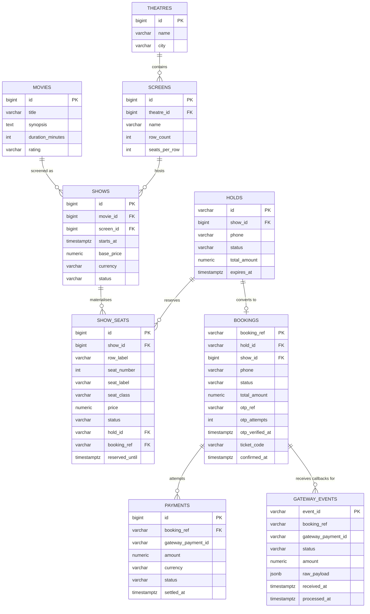

# 03 — Data Model

**Purpose:** the schema, the atomic seat-claim statement, the index plan, and — critically — the
Alembic recovery procedure.
**Read this when:** writing models, generating a migration, or when Alembic says "Multiple head
revisions are present".
**Status:** **FINAL.** §2/§3 derive from `04-api-contract.md` (canonical). §5 is problem-agnostic
and is preserved verbatim from the pre-reveal draft.

> **Two sections carry more weight than the rest of this file:**
> **§4** is the answer to REQ-07 (*"never sells the same seat twice"*) and to Scenario A.
> **§5** is the Alembic recovery procedure. Read it before generating the first migration, not
> after the first failure.

---

## §1 — Schema conventions (apply to every table, no exceptions)

| Rule | Value | Why |
| :--- | :--- | :--- |
| Primary key — catalogue | `id BIGSERIAL PRIMARY KEY` (`Mapped[int] = mapped_column(BigInteger, primary_key=True)`) | `movies`, `theatres`, `screens`, `shows`, `show_seats`, `payments`. Simple, indexable, monotonic. |
| Primary key — **customer-visible** | `VARCHAR(30) PRIMARY KEY` holding `"<prefix>_" + secrets.token_urlsafe(16)` — **128 bits**, URL-safe (`hld_…`, `bk_…`) | `holds`, `bookings`. `04-api-contract.md` §6: these references *are* the access capability, so they must not be enumerable. Using the reference itself as the PK avoids a second surrogate column and a lookup join. **This is the one documented exception to the BIGSERIAL rule.** No new dependency — `core/ids.py`, stdlib only. |
| Timestamps | `created_at TIMESTAMPTZ NOT NULL DEFAULT now()`, `updated_at` with `onupdate` | `TIMESTAMPTZ` **always** — never naive `TIMESTAMP`. Half of all date bugs come from this, and this system is entirely about time. |
| Naming | `snake_case`, plural tables, singular columns | Predictable in raw `psql` at 16:00. |
| Nullability | `NOT NULL` unless there is a written reason it is optional | Nullable-by-default is how "unknown state" bugs get in. |
| Strings | `VARCHAR(n)` with a deliberate `n` | DB-level length limit backs up Pydantic (defence in depth, REQ-61). |
| Enums | Python `str, Enum` + `VARCHAR` + a `CHECK` constraint | Native PG enums are painful to `ALTER` mid-build. Never worth it today. |
| **Money** | **`NUMERIC(10,2)`** — never `FLOAT` | Float money is a defence-question trap. Serialized as a **string** on the wire (`04-api-contract.md` §1). |
| Foreign keys | Always explicit, always with a chosen `ON DELETE` | See §6. |
| Soft deletes | **Not used.** Nothing in `problem_statement.md` requires history beyond `gateway_events`. | Complexity with no scored payoff. |
| Constraint naming | `naming_convention` on the `DeclarativeBase` | Unnamed constraints are unmigratable later. Set this in `db/base.py` **before** the first migration. |

---

## §2 — ER diagram



**Nine tables.** Four are read-only seeded catalogue (`movies`, `theatres`, `screens`, `shows`) and
carry no business logic at all. The engineering lives in the other five.

---

## §3 — Tables

### `movies` — REQ-01, REQ-10

| column | type | constraints | default | serves |
| :--- | :--- | :--- | :--- | :--- |
| `id` | `BIGSERIAL` | PK | | |
| `title` | `VARCHAR(200)` | `NOT NULL` | | REQ-01 |
| `synopsis` | `TEXT` | `NOT NULL` | `''` | REQ-01 |
| `duration_minutes` | `INTEGER` | `NOT NULL`, `CHECK (> 0)` | | REQ-01 |
| `rating` | `VARCHAR(10)` | `NOT NULL` | `'NR'` | REQ-01 |
| `created_at` / `updated_at` | `TIMESTAMPTZ` | `NOT NULL` | `now()` | |

### `theatres` — REQ-01, REQ-10

| column | type | constraints | serves |
| :--- | :--- | :--- | :--- |
| `id` | `BIGSERIAL` | PK | |
| `name` | `VARCHAR(150)` | `NOT NULL` | REQ-01 |
| `city` | `VARCHAR(80)` | `NOT NULL` | REQ-01 |
| `created_at` / `updated_at` | `TIMESTAMPTZ` | `NOT NULL DEFAULT now()` | |

### `screens` — REQ-01, REQ-10

The physical seat **layout** lives here, once per screen, not once per show.

| column | type | constraints | serves |
| :--- | :--- | :--- | :--- |
| `id` | `BIGSERIAL` | PK | |
| `theatre_id` | `BIGINT` | `NOT NULL`, FK `theatres(id) ON DELETE CASCADE` | REQ-01 |
| `name` | `VARCHAR(50)` | `NOT NULL`, `UNIQUE (theatre_id, name)` | REQ-01 |
| `row_count` | `INTEGER` | `NOT NULL`, `CHECK (BETWEEN 1 AND 26)` | REQ-10 — rows are `A`…`Z` |
| `seats_per_row` | `INTEGER` | `NOT NULL`, `CHECK (BETWEEN 1 AND 30)` | REQ-10 |
| `premium_from_row` | `VARCHAR(1)` | `NOT NULL`, default `'E'` | seat classes/prices (REQ-10) |

> `CHECK (row_count * seats_per_row <= 400)` — the seat map is returned unpaginated
> (`04-api-contract.md` §4.1), so the layout size is bounded at the schema level rather than by hope.

### `shows` — REQ-01, REQ-10

| column | type | constraints | serves |
| :--- | :--- | :--- | :--- |
| `id` | `BIGSERIAL` | PK | |
| `movie_id` | `BIGINT` | `NOT NULL`, FK `movies(id) ON DELETE RESTRICT` | REQ-01 |
| `screen_id` | `BIGINT` | `NOT NULL`, FK `screens(id) ON DELETE RESTRICT` | REQ-01 |
| `starts_at` | `TIMESTAMPTZ` | `NOT NULL`, `UNIQUE (screen_id, starts_at)` | REQ-01 — one film per screen per slot |
| `base_price` | `NUMERIC(10,2)` | `NOT NULL`, `CHECK (> 0)` | REQ-10 |
| `currency` | `VARCHAR(3)` | `NOT NULL`, default `'BDT'` | REQ-10 |
| `status` | `VARCHAR(20)` | `NOT NULL`, `CHECK (IN ('SCHEDULED','STARTED','CANCELLED'))`, default `'SCHEDULED'` | rejects holds on a started show |
| `created_at` / `updated_at` | `TIMESTAMPTZ` | `NOT NULL DEFAULT now()` | |

### ★ `show_seats` — REQ-02, REQ-03, REQ-06, REQ-07

**The contention table.** One row per (show, seat). Everything hot happens here.

| column | type | constraints | default | serves |
| :--- | :--- | :--- | :--- | :--- |
| `id` | `BIGSERIAL` | PK | | |
| `show_id` | `BIGINT` | `NOT NULL`, FK `shows(id) ON DELETE CASCADE` | | REQ-02 |
| `row_label` | `VARCHAR(2)` | `NOT NULL` | | REQ-02 |
| `seat_number` | `INTEGER` | `NOT NULL`, `CHECK (> 0)` | | REQ-02 |
| `seat_label` | `VARCHAR(5)` | `NOT NULL` — `row_label \|\| seat_number` | | REQ-20 — the label judges type |
| `seat_class` | `VARCHAR(20)` | `NOT NULL`, `CHECK (IN ('STANDARD','PREMIUM'))` | `'STANDARD'` | REQ-10 |
| `price` | `NUMERIC(10,2)` | `NOT NULL`, `CHECK (> 0)` | | REQ-10 — copied at seed time, so a later price change cannot alter an existing hold |
| **`status`** | `VARCHAR(20)` | `NOT NULL`, `CHECK (IN ('AVAILABLE','HELD','PAYMENT_PENDING','BOOKED'))` | `'AVAILABLE'` | **REQ-07** |
| `hold_id` | `VARCHAR(30)` | `NULL`, FK `holds(id) ON DELETE SET NULL` | `NULL` | REQ-03 |
| `booking_ref` | `VARCHAR(30)` | `NULL`, FK `bookings(booking_ref) ON DELETE SET NULL` | `NULL` | REQ-05 |
| **`reserved_until`** | `TIMESTAMPTZ` | `NULL` | `NULL` | **REQ-06** — set for `HELD` and `PAYMENT_PENDING`, `NULL` for `AVAILABLE`/`BOOKED` |
| `updated_at` | `TIMESTAMPTZ` | `NOT NULL DEFAULT now()` | | |

**Constraints that are the correctness backstop, not decoration:**

```sql
UNIQUE (show_id, row_label, seat_number)          -- physical seat exists once per show
UNIQUE (show_id, seat_label)                      -- the label judges send resolves to one row
CHECK  ((status = 'AVAILABLE' AND reserved_until IS NULL AND hold_id IS NULL)
     OR (status IN ('HELD','PAYMENT_PENDING') AND reserved_until IS NOT NULL)
     OR (status = 'BOOKED' AND booking_ref IS NOT NULL))
```
> That `CHECK` makes "held with no expiry" — the state that silently loses a seat forever —
> **unrepresentable**. It is worth the three minutes it costs to write.

**Seat status machine:**
```
AVAILABLE ──POST /holds──▶ HELD ──POST /pay──▶ PAYMENT_PENDING ──callback SUCCEEDED──▶ BOOKED
    ▲                        │                       │
    │                        │                       ├── callback FAILED / REFUNDED ──┐
    └──── reserved_until elapsed (lazy or sweeper) ───┴────────────────────────────────┘
```

### `holds` — REQ-03, REQ-06, REQ-39

The aggregate for a multi-seat claim, so a booking of three seats is atomic.

| column | type | constraints | serves |
| :--- | :--- | :--- | :--- |
| `id` | `VARCHAR(30)` | PK — `hld_` + 128-bit token (§1) | REQ-03 |
| `show_id` | `BIGINT` | `NOT NULL`, FK `shows(id) ON DELETE CASCADE` | REQ-03 |
| `phone` | `VARCHAR(20)` | `NOT NULL` | INF-07 |
| `status` | `VARCHAR(20)` | `NOT NULL`, `CHECK (IN ('ACTIVE','EXPIRED','CONVERTED','RELEASED'))`, default `'ACTIVE'` | REQ-39 |
| `seat_count` | `INTEGER` | `NOT NULL`, `CHECK (BETWEEN 1 AND 10)` | denormalised for the Scenario A report |
| `total_amount` | `NUMERIC(10,2)` | `NOT NULL` | REQ-04 |
| `currency` | `VARCHAR(3)` | `NOT NULL DEFAULT 'BDT'` | |
| `expires_at` | `TIMESTAMPTZ` | `NOT NULL` | **REQ-06, REQ-19** — `created_at + HOLD_TTL_SECONDS` |
| `created_at` | `TIMESTAMPTZ` | `NOT NULL DEFAULT now()` | REQ-39 timeline evidence |

> `holds.expires_at` and `show_seats.reserved_until` are set from the same value at creation.
> `show_seats.reserved_until` is the **authoritative** one — it is what the claim predicate reads.
> `holds.expires_at` exists so `GET /holds/{id}` answers without touching `show_seats`.

### `bookings` — REQ-05, REQ-08

| column | type | constraints | serves |
| :--- | :--- | :--- | :--- |
| `booking_ref` | `VARCHAR(30)` | PK — `bk_` + 128-bit token (§1). **Sent to the gateway and echoed back in every callback.** | REQ-05, REQ-14 |
| `hold_id` | `VARCHAR(30)` | `NOT NULL`, `UNIQUE`, FK `holds(id) ON DELETE RESTRICT` | REQ-05 — one booking per hold, enforced by the DB |
| `show_id` | `BIGINT` | `NOT NULL`, FK `shows(id) ON DELETE RESTRICT` | REQ-05 |
| `phone` | `VARCHAR(20)` | `NOT NULL` | INF-07 |
| `status` | `VARCHAR(20)` | `NOT NULL`, `CHECK (IN ('PENDING_OTP','OTP_VERIFIED','PAYMENT_PENDING','CONFIRMED','FAILED','EXPIRED','REFUNDED'))` | REQ-05 |
| `total_amount` | `NUMERIC(10,2)` | `NOT NULL` | REQ-04 |
| `currency` | `VARCHAR(3)` | `NOT NULL DEFAULT 'BDT'` | |
| `otp_ref` | `VARCHAR(64)` | `NULL` | REQ-08 — the `ref` passed to `/otp/send` |
| `otp_attempts` | `INTEGER` | `NOT NULL DEFAULT 0` | OTP brute-force lock (`04-api-contract.md` §8) |
| `otp_verified_at` | `TIMESTAMPTZ` | `NULL` | REQ-08 — gates `/pay` |
| `otp_last_sent_at` | `TIMESTAMPTZ` | `NULL` | 30 s resend throttle |
| `ticket_code` | `VARCHAR(40)` | `NULL`, `UNIQUE` | REQ-05 — issued on confirmation |
| `confirmed_at` | `TIMESTAMPTZ` | `NULL` | REQ-05 |
| `created_at` / `updated_at` | `TIMESTAMPTZ` | `NOT NULL DEFAULT now()` | |

### `payments` — REQ-04, REQ-14

| column | type | constraints | serves |
| :--- | :--- | :--- | :--- |
| `id` | `BIGSERIAL` | PK | |
| `booking_ref` | `VARCHAR(30)` | `NOT NULL`, FK `bookings(booking_ref) ON DELETE CASCADE` | REQ-04 |
| `gateway_payment_id` | `VARCHAR(64)` | `NULL`, `UNIQUE` | REQ-04 — **nullable on purpose**: the row is written *before* `/charge` is called (see §4.3) |
| `amount` | `NUMERIC(10,2)` | `NOT NULL`, `CHECK (> 0)` | REQ-14 — *"must not double-count revenue"* |
| `currency` | `VARCHAR(3)` | `NOT NULL DEFAULT 'BDT'` | |
| `status` | `VARCHAR(20)` | `NOT NULL`, `CHECK (IN ('PENDING','SUCCEEDED','FAILED','REFUNDED'))`, default `'PENDING'` | REQ-16 |
| `failure_reason` | `VARCHAR(200)` | `NULL` | REQ-15 |
| `settled_at` | `TIMESTAMPTZ` | `NULL` | REQ-05 |
| `created_at` / `updated_at` | `TIMESTAMPTZ` | `NOT NULL DEFAULT now()` | |

```sql
-- At most ONE live payment per booking. A retry after FAILED is allowed; a duplicate
-- callback creating a second PENDING/SUCCEEDED row is impossible.  REQ-14, enforced by the DB.
CREATE UNIQUE INDEX uq_payments_live_per_booking
    ON payments (booking_ref) WHERE status IN ('PENDING', 'SUCCEEDED');
```
> This partial unique index is the second of the two independent defences behind REQ-14. Say
> "*the database makes a second payment impossible, not our code*" and show this line.

### ★ `gateway_events` — REQ-13, REQ-14, INF-06

**The idempotency ledger.** Every callback the gateway delivers lands here first.

| column | type | constraints | serves |
| :--- | :--- | :--- | :--- |
| `event_id` | `VARCHAR(64)` | **PK** — the gateway's `event_id` | **REQ-14** |
| `booking_ref` | `VARCHAR(30)` | `NOT NULL` — **no FK**, see note | REQ-14 |
| `gateway_payment_id` | `VARCHAR(64)` | `NULL` | REQ-14 |
| `status` | `VARCHAR(20)` | `NOT NULL`, `CHECK (IN ('SUCCEEDED','FAILED','REFUNDED'))` | REQ-16 |
| `amount` | `NUMERIC(10,2)` | `NOT NULL` | REQ-14 |
| `raw_payload` | `JSONB` | `NOT NULL` | REQ-15 — the exact body, for post-mortem |
| `received_at` | `TIMESTAMPTZ` | `NOT NULL DEFAULT now()` | REQ-15 — measures the 2–15 s delay |
| `processed_at` | `TIMESTAMPTZ` | `NULL` | reconciliation sweep (REQ-44) |
| `process_error` | `VARCHAR(300)` | `NULL` | why processing failed |

> **No foreign key on `booking_ref`, deliberately.** A callback for an unknown booking must still
> be recorded (and answered 200 — REQ-13); an FK would reject the insert and lose the evidence.
> Referential integrity here is worth less than never dropping a callback.

> **The PK *is* the idempotency key.** `INSERT … ON CONFLICT (event_id) DO NOTHING` returning zero
> rows is the entire duplicate check. No application-level "have I seen this?" logic exists,
> because application-level checks race and unique indexes do not.

---

## §4 — ★ CONCURRENCY: how a seat is claimed exactly once (REQ-07, REQ-38)

`problem_statement.md:196` — *"Oversell must be zero. Exactly one request may succeed. Ninety-nine
must be cleanly rejected."* This section is that guarantee. **Know it cold; it is the first thing
the panel will probe.**

### 4.1 — The claim: one statement, one transaction

```sql
-- app/repositories/seat.py — the only place this statement exists.
UPDATE show_seats
   SET status         = 'HELD',
       hold_id        = :hold_id,
       reserved_until = :expires_at,
       updated_at     = now()
 WHERE show_id    = :show_id
   AND seat_label = ANY(:seat_labels)
   AND (
         status = 'AVAILABLE'
         OR (status IN ('HELD', 'PAYMENT_PENDING') AND reserved_until <= now())
       )
RETURNING id, seat_label, seat_class, price;
```

Then, in the same transaction:

```python
if len(returned_rows) != len(requested_labels):
    raise SeatUnavailableError(...)     # -> rollback -> 409 SEAT_UNAVAILABLE
```

**Why this is correct under 100 simultaneous requests:**

| Property | Mechanism |
| :--- | :--- |
| **No read-then-write race** | There is no read. The predicate and the write are one statement, so no window exists between checking and claiming. This is the entire bug class the problem is built around. |
| **Row locks serialise contenders** | Postgres takes a row-level exclusive lock while the `UPDATE` evaluates. The 99 losers re-evaluate the predicate **after** the winner commits, see `status = 'HELD'` with a future `reserved_until`, match nothing, and get `RETURNING` zero rows. |
| **All-or-nothing multi-seat** | `RETURNING` row count `!=` requested count ⇒ rollback. There is no partial hold. |
| **Expiry is enforced here, not by a job** | The `reserved_until <= now()` branch means an expired hold is reclaimable **the instant it expires**, whether or not the sweeper has run. The sweeper is for tidiness and observability; **this predicate is for correctness** (REQ-06). |
| **No deadlocks** | It is a single statement, so both contenders acquire locks in the same scan order. Multi-statement lock-then-update patterns are where deadlocks live. A `DeadlockDetected` retry (once, 50 ms) is wired anyway as belt and braces. |
| **Isolation level** | Default `READ COMMITTED` is sufficient and is what we use. `UPDATE` re-checks the `WHERE` clause against the newly committed row version (`EvalPlanQual`), which is exactly the behaviour we need. `SERIALIZABLE` would add serialization failures and retry logic for no additional guarantee here. **This is a deliberate choice and a good answer.** |

**Alternatives rejected** (full ADR in `02-architecture.md` §5d):

| Rejected | Why |
| :--- | :--- |
| `SELECT … FOR UPDATE` then `UPDATE` | Two statements, a lock-ordering deadlock risk on multi-seat holds, and one extra round trip per request on the hottest path. No added safety. |
| Redis `SETNX` lock per seat | Two sources of truth for one invariant. If Redis and Postgres disagree — and under partition they will — the seat is oversold. Also a banned dependency without justification. |
| Application-level mutex / queue | Correct for one process. We run **two** uvicorn workers behind an Nginx upstream (REQ-47), so it is wrong by construction. |
| `SERIALIZABLE` + retry | Correct, but converts contention into serialization failures the client must retry. Under a 100-request burst that is strictly worse UX for zero extra safety. |

### 4.2 — Reading: the same predicate, applied lazily

Every read that reports availability applies expiry in SQL, so the seat map never lies while
waiting for the sweeper:

```sql
SELECT seat_label, row_label, seat_number, seat_class, price,
       CASE
         WHEN status IN ('HELD','PAYMENT_PENDING') AND reserved_until <= now() THEN 'AVAILABLE'
         WHEN status = 'PAYMENT_PENDING'                                        THEN 'HELD'
         ELSE status
       END                                                    AS effective_status,
       CASE WHEN status IN ('HELD','PAYMENT_PENDING') AND reserved_until > now()
            THEN reserved_until END                           AS held_until
  FROM show_seats
 WHERE show_id = :show_id
 ORDER BY row_label, seat_number;
```
> `PAYMENT_PENDING` is reported to clients as `HELD` — the internal distinction is ours, and
> leaking it would tell an attacker which seats are mid-payment.

### 4.3 — Releasing: two mechanisms, one authoritative

| Mechanism | When | Role |
| :--- | :--- | :--- |
| **Lazy (the predicate above)** | On every claim and every read | **Authoritative.** Correctness does not depend on any background task running. |
| **Sweeper task** | `asyncio` loop in the app lifespan, every `SWEEP_INTERVAL_SECONDS` (default 5) | Tidiness: flips rows to `AVAILABLE`, marks `holds.status = 'EXPIRED'` and `bookings.status = 'EXPIRED'` so `GET /holds/{id}` reports honestly (REQ-39) and `seats_available` counts stay cheap. |

```sql
-- The sweeper. Idempotent, safe to run concurrently in both uvicorn workers.
UPDATE show_seats
   SET status = 'AVAILABLE', hold_id = NULL, booking_ref = NULL,
       reserved_until = NULL, updated_at = now()
 WHERE status IN ('HELD','PAYMENT_PENDING') AND reserved_until <= now();
```
> ⚠️ With `--workers 2` **and** two API replicas (REQ-47), four sweepers run. The statement is
> idempotent so this is harmless, just slightly wasteful. Stated honestly in
> `02-architecture.md` §5d rather than pretended away.

### 4.4 — The callback race, and why `booking_ref` is the join key

`X-Mock-Force: race` delivers the callback **before `/charge` returns** (REQ-17). If we matched
callbacks on `gateway_payment_id`, the race would arrive before we had one.

**Therefore:** the `payments` row is written with our own `booking_ref` **before** the gateway is
called; `gateway_payment_id` is backfilled when `/charge` responds — or by the callback itself,
whichever wins. The gateway echoes `booking_ref` in every callback, so the join key always exists.

```
t0  INSERT payments (booking_ref, status='PENDING', gateway_payment_id=NULL)   COMMIT
t1  POST {gateway}/charge  ────────────────────────────────────────────────▶
t2      ◀──── callback (booking_ref, payment_id)   [may arrive before t3]
t3      ◀──── /charge 202 { payment_id }
```
Both t2 and t3 do `UPDATE payments SET gateway_payment_id = COALESCE(gateway_payment_id, :id)`.
Order does not matter. **This is a 15-minute design decision that removes an entire class of bug**,
and it is the best answer available to *"how did you handle the race?"*

---

## §5 — ALEMBIC WORKFLOW AND RECOVERY — FINAL, READ IN FULL

*Preserved verbatim from the pre-reveal plan. Problem-agnostic and hard-won.*

### 5.1 Setup (once, Phase 3)

```bash
# inside backend/
alembic init -t async alembic        # or plain `alembic init alembic` for sync engine
```

Then, non-negotiable edits:

| File | Edit | Why |
| :--- | :--- | :--- |
| `alembic.ini` | **Delete/blank** the hardcoded `sqlalchemy.url` | The URL comes from env; a hardcoded one is a committed secret (REQ-58) and will point at the wrong DB on the VM. |
| `alembic/env.py` | `config.set_main_option("sqlalchemy.url", get_settings().database_url)` | Single source of config. |
| `alembic/env.py` | `target_metadata = Base.metadata`, and **import every model module** (`from app.models import *` via `app/models/__init__.py`) | A model that is not imported is invisible to autogenerate — it silently produces an empty migration. This is failure mode #1. |
| `alembic/env.py` | `compare_type=True`, `compare_server_default=True` in both `context.configure(...)` calls | Otherwise type changes are silently ignored. |

### 5.2 The normal loop — every single time

```bash
# 1. Confirm there is exactly ONE head BEFORE you start.
docker compose exec api alembic heads
#    expected: exactly one line, e.g.  a1b2c3d4e5f6 (head)
#    two or more lines -> STOP, go to 5.4 before doing anything else.

# 2. Generate.
docker compose exec api alembic revision --autogenerate -m "add <thing>"
#    expected: "Generating /app/alembic/versions/xxxx_add_<thing>.py ... done"

# 3. READ THE FILE. Non-negotiable.
#    Look for: unintended DROP TABLE / DROP COLUMN, a missing server_default on a new
#    NOT NULL column (fails on a non-empty table), enum churn, an empty upgrade() body.
#    An empty upgrade() means the model was not imported -> fix env.py, delete, regenerate.

# 4. Apply.
docker compose exec api alembic upgrade head
#    expected: "Running upgrade <prev> -> <new>, add <thing>"

# 5. Confirm ONE head after.
docker compose exec api alembic heads
docker compose exec api alembic current
#    expected: current == the head you just applied, marked (head)

# 6. Commit the migration WITH the model change, in the same commit.
git add backend/alembic/versions/ backend/app/models/
git commit -m "feat(db): add <thing>"
```

**Rules that prevent 90% of Alembic pain:**
1. **One migration per commit.** Never two people (or two sessions) generating at once.
2. **Never edit an applied migration.** Write a new one.
3. **Never hand-write a `down_revision`** unless executing the merge procedure below.
4. **Adding a `NOT NULL` column to a non-empty table** requires `server_default=...` in the migration, or a three-step (add nullable → backfill → set not null). Autogenerate will not do this for you.
5. Migrations run **inside the api container**, not on the host — the host has no `DATABASE_URL` and cannot resolve `db`.

### 5.3 Diagnosing history

```bash
docker compose exec api alembic history --verbose      # full chain, parent pointers
docker compose exec api alembic heads                  # every leaf; should be ONE
docker compose exec api alembic current                # what the DB believes is applied
docker compose exec api alembic branches               # any fork points
```

A healthy `history` is a straight chain: `<base> -> rev1 -> rev2 -> rev3 (head)`.

### 5.4 🔴 RECOVERY: "Multiple head revisions are present"

**The error you will actually see:**

```
FAILED: Multiple head revisions are present for given argument 'head';
please specify a specific target revision, '<branchname>@head' to narrow to a
specific head, or 'heads' for all heads
```

or, on autogenerate:

```
ERROR [alembic.util.messaging] Multiple heads are present; please specify a specific target
```

**Cause:** two migrations were generated from the same parent — typically two sessions/branches, or a regenerate after a `git pull` that brought in someone else's migration.

**Procedure — do these in order, do not skip step 1:**

```bash
# 1. SEE the damage. Two or more lines = two or more heads.
docker compose exec api alembic heads
#   a1b2c3d4e5f6 (head)
#   f6e5d4c3b2a1 (head)

docker compose exec api alembic history --verbose | head -40
#   identify the common ancestor and which head is already applied

docker compose exec api alembic current
#   whichever head this shows is the one the DB has actually run
```

**Path A — the two heads are genuinely different, needed changes (normal case):**

```bash
# 2. Create a merge revision joining both heads.
docker compose exec api alembic merge -m "merge heads" a1b2c3d4e5f6 f6e5d4c3b2a1
#    expected: "Generating .../xxxx_merge_heads.py ... done"
#    The generated file has down_revision = ('a1b2c3d4e5f6', 'f6e5d4c3b2a1') — a tuple. This is correct.

# 3. Verify there is now exactly ONE head.
docker compose exec api alembic heads
#    expected: one line — the merge revision

# 4. Apply.
docker compose exec api alembic upgrade head
docker compose exec api alembic current      # == merge revision (head)

# 5. Commit the merge migration immediately.
git add backend/alembic/versions/ && git commit -m "fix(db): merge alembic heads"
```

**Path B — one head is a duplicate/mistake and was NEVER applied anywhere (early build, safest fix):**

```bash
# Confirm it is not applied: `alembic current` does NOT show it, and it is not in anyone else's branch.
rm backend/alembic/versions/<the_bad_revision>_*.py
docker compose exec api alembic heads     # expected: one head
git add -A && git commit -m "fix(db): drop stray migration"
```

**Path C — nuclear, ONLY before real demo data exists (Phase 3, and never after):**

```bash
# Destroys the database. NEVER run this after seeding the demo or after 15:00.
docker compose down
docker volume rm hackathon_pgdata      # exact name: docker volume ls
rm backend/alembic/versions/*.py
docker compose up -d db
docker compose exec api alembic revision --autogenerate -m "baseline schema"
docker compose exec api alembic upgrade head
```

**If `alembic current` shows a revision that does not exist in `versions/`** (DB ahead of code, e.g. after a rollback):

```bash
docker compose exec api alembic stamp <a_revision_that_does_exist>   # rewrite the DB's bookmark
docker compose exec api alembic upgrade head
```

**Prevention checklist — pin this above the desk:**
- [ ] `alembic heads` before generating. Always.
- [ ] `alembic heads` after generating. Always.
- [ ] One migration per commit, generated by one person at a time.
- [ ] After every `git pull` that touches `alembic/versions/`: `alembic heads` → then `upgrade head`.
- [ ] Read the generated file before applying. Every time.

### 5.5 Deploying migrations

Migrations run **inside a container**, never as the API's entrypoint — an auto-migration that fails
takes the API down with it and the container restart-loops with no way to debug through it.

**How REQ-21 (*"`docker compose up` works from a clean clone with no manual steps"*) is satisfied
without breaking that rule:** a dedicated one-shot `migrate` service runs
`alembic upgrade head && python -m app.seed` and exits; `api` waits on
`depends_on: { migrate: { condition: service_completed_successfully } }`. A failed migration stops
the API from starting **and leaves a readable exited container to inspect** — which is the
behaviour we wanted all along. Compose definition: `07-containerization.md` §3.

```bash
docker compose up -d --build
docker compose ps -a                                 # migrate = Exited (0); db, api = healthy
docker compose logs migrate                          # the upgrade + seed summary
docker compose exec api alembic current              # expected: <rev> (head)
curl -fsS https://poridhi-hackathon.shadathossainrony.dev/ready   # expected: {"status":"ready",...}
```

---

## §6 — Foreign keys and `ON DELETE` policy

| Relationship | `ON DELETE` | Reasoning |
| :--- | :--- | :--- |
| `screens → theatres` | `CASCADE` | A screen cannot exist without its theatre. |
| `shows → movies`, `shows → screens` | `RESTRICT` | Deleting a movie with sold tickets must fail loudly, not silently orphan bookings. |
| `show_seats → shows` | `CASCADE` | Seat inventory is meaningless without the show. |
| `show_seats → holds`, `show_seats → bookings` | `SET NULL` (column nullable) | Losing a hold must **release** the seat, never delete it. This is the difference between a released seat and a vanished seat. |
| `holds → shows`, `bookings → shows` | `RESTRICT` / `CASCADE` respectively | Bookings die with their show; a hold does not survive one either. |
| `bookings → holds` | `RESTRICT` + `UNIQUE(hold_id)` | One booking per hold, enforced by the database. |
| `payments → bookings` | `CASCADE` | A payment without its booking is unauditable noise. |
| `gateway_events → bookings` | **no FK** | §3 — an unknown-booking callback must still be recorded and answered 200 (REQ-13). |

**In practice nothing is ever deleted during the event.** Expiry sets `status`, it does not
`DELETE`. Say that when asked what happens on delete — the honest answer is "nothing deletes".

---

## §7 — Index plan

Every index names the query it serves and the endpoint that issues it. No speculative indexes.

| Index | Table / columns | Type | Query it serves | Endpoint |
| :--- | :--- | :--- | :--- | :--- |
| `uq_show_seats_show_label` | `show_seats(show_id, seat_label)` | UNIQUE | ★ **the claim predicate** `WHERE show_id=? AND seat_label = ANY(?)` — a unique index lookup per seat, so 100 concurrent claims contend on one row, not one table | `POST /holds` |
| `uq_show_seats_show_row_num` | `show_seats(show_id, row_label, seat_number)` | UNIQUE | ★ **the seat map** `WHERE show_id=? ORDER BY row_label, seat_number` — index scan, pre-sorted, no `Sort` node | `GET /shows/{id}/seats` |
| `ix_show_seats_show_status` | `show_seats(show_id, status)` | btree | `seats_available` / `summary` aggregates | `GET /shows`, `GET /shows/{id}/seats` |
| `ix_show_seats_sweep` | `show_seats(reserved_until) WHERE status IN ('HELD','PAYMENT_PENDING')` | **partial** btree | ★ the sweeper `WHERE status IN (…) AND reserved_until <= now()` — partial because 95%+ of rows are `AVAILABLE`/`BOOKED` and indexing them is pure write cost | sweeper task |
| `ix_shows_starts_at` | `shows(starts_at)` | btree | `GET /shows?date=` | `GET /shows` |
| `ix_shows_movie_id` | `shows(movie_id)` | btree | `?movie_id=`, and the FK check. **Postgres does not index the referencing side of an FK automatically** | `GET /shows` |
| `ix_shows_screen_id` | `shows(screen_id)` | btree | same, via theatre | `GET /shows` |
| `uq_bookings_hold_id` | `bookings(hold_id)` | UNIQUE | one booking per hold (correctness, not speed) | `POST /bookings` |
| `uq_payments_live_per_booking` | `payments(booking_ref) WHERE status IN ('PENDING','SUCCEEDED')` | **partial** UNIQUE | ★ REQ-14 — a second live payment is impossible | callback |
| `ix_payments_booking_ref` | `payments(booking_ref)` | btree | payment lookup for `GET /bookings/{ref}` | `GET /bookings/{ref}` |
| `gateway_events_pkey` | `gateway_events(event_id)` | implicit PK | ★ REQ-14 — `ON CONFLICT (event_id) DO NOTHING` | callback |
| `ix_gateway_events_unprocessed` | `gateway_events(received_at) WHERE processed_at IS NULL` | **partial** btree | the reconciliation sweep; normally matches zero rows, so it costs almost nothing | reconciliation |
| `uq_bookings_ticket_code` | `bookings(ticket_code)` | UNIQUE | correctness | callback |

**Verify during the load run and screenshot it** (`10-testing-and-load.md` §6):

```bash
docker compose exec db psql -U "$POSTGRES_USER" -d "$POSTGRES_DB" -c \
  "EXPLAIN ANALYZE SELECT * FROM show_seats WHERE show_id = 1 ORDER BY row_label, seat_number;"
# expected: Index Scan using uq_show_seats_show_row_num   -- NOT Seq Scan, and NOT a Sort node

docker compose exec db psql -U "$POSTGRES_USER" -d "$POSTGRES_DB" -c \
  "EXPLAIN ANALYZE UPDATE show_seats SET status='HELD' WHERE show_id=1 AND seat_label='F12' AND status='AVAILABLE';"
# expected: Index Scan using uq_show_seats_show_label
```

*"What breaks first under load?"* is answered far better with *"we checked the plan; the claim is a
unique index lookup and the contention is one row wide"* than with *"we added indexes."*

---

## §8 — Seed data (REQ-10 — a stated requirement, not a nicety)

`problem_statement.md:50` — *"Pre-populate the database with movies, theatres, showtimes, seat
layouts, and prices."*

| Decision | Choice |
| :--- | :--- |
| Mechanism | `backend/app/seed.py`, run by the **one-shot `migrate` service** on every `docker compose up` (REQ-21). Also runnable by hand: `docker compose exec api python -m app.seed`. **Not** an Alembic data migration — mixing schema and data migrations makes rollback ugly. |
| Idempotency | Every insert is get-or-create on a natural key (movie title, theatre name, `(screen_id, starts_at)`). Running it ten times must not duplicate or crash. Ends by printing a summary. |
| Volume | **4 movies · 2 theatres · 3 screens · 12 shows · ~1 100 `show_seats` rows.** Enough that the seat map looks real and the load test has room; small enough to eyeball in `psql`. |
| Seat layout | Rows `A`…`H` (8), 12 per row = 96 seats per screen. Rows `A`–`D` `STANDARD` at `base_price`; rows `E`–`H` `PREMIUM` at `base_price × 1.3`, rounded to 2 dp. |
| Pre-sold state | ~20% of seats on the **premiere show** are pre-`BOOKED` with synthetic bookings, so the seat map is visibly non-uniform and the demo is not a wall of green. **Seat `F12` on show 1 is left `AVAILABLE` deliberately** — it is the seat named in `problem_statement.md:21` and it is the target of Scenario A. |
| Demo identities | Phone numbers `+8801700000001` … `+8801700000005`, listed in the README. **No passwords, because there is no login** (`04-api-contract.md` §6). |
| Load/scenario cleanup | Scenario A and C create real holds. Reset before the demo: `docker compose exec api python -m app.seed --reset-shows` releases every non-seeded hold and restores the pre-sold pattern. |

**Order on any fresh environment:** `alembic upgrade head` → `python -m app.seed` → smoke → demo.
On a clean clone this is the `migrate` container, automatically, with no human involved.

---

**Cross-links:** requirements → `01-problem-analysis.md` · the contract these tables serve →
`04-api-contract.md` · design rationale and ADRs → `02-architecture.md` · repositories/services →
`05-backend-plan.md` · migration commands in deploy context → `08-deployment-runbook.md` ·
Alembic failures → `15-troubleshooting.md` §A · concurrency tests → `10-testing-and-load.md` §3
