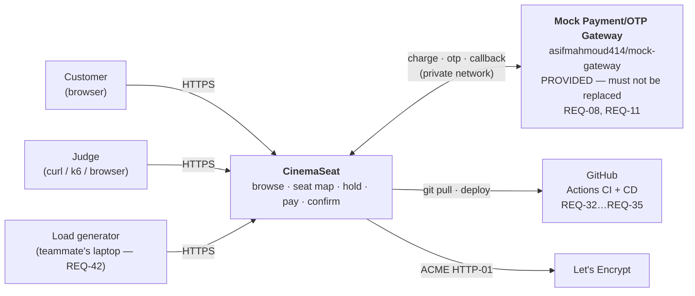
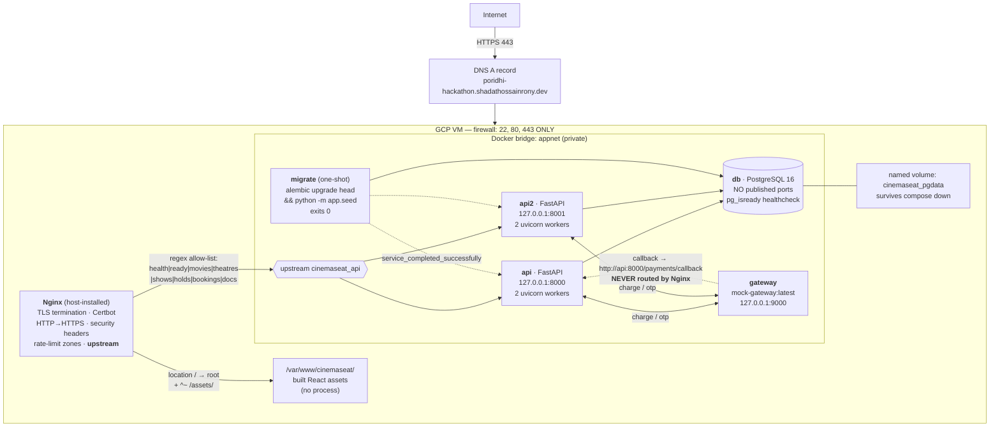
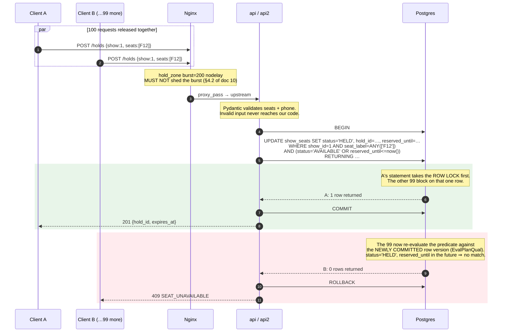

# 02 — Architecture

**Purpose:** the system design, why it is shaped that way, what breaks, and the exact words to say
when a judge asks.
**Read this when:** designing, deploying, or ten minutes before the panel Q&A.
**Status:** **FINAL**, conforming to `04-api-contract.md` (canonical) and `03-data-model.md`.

Scoring: **System Architecture & Design = 25**, the largest single row, and **first in the tie-break
order** (`rulebook.md` §7.3). `problem_statement.md:153` — *"Architecture is the backbone here."*
`:157` — *"A fancy diagram you cannot explain is worse than a simple design you can defend."*

**The design in one sentence:** *one deployable FastAPI service whose only hard invariant — one seat,
one hold — is enforced by a single atomic SQL statement in Postgres, fronted by Nginx across two
stateless replicas, and insulated from a deliberately unreliable payment gateway by timeouts, a
circuit breaker, and an idempotency ledger keyed on the gateway's own event ID.*

---

## §5a — Context and containers

### Context



> The gateway is **inside our trust boundary but outside our control**: we run the container, we
> cannot change its behaviour, and by specification it misbehaves (REQ-15). Most of the interesting
> design in this system is about that one relationship.

### Containers



ASCII fallback — **draw this one on the whiteboard:**

```
 Internet ── https://poridhi-hackathon.shadathossainrony.dev
    |
 [DNS A] ──▶ [VM :443]
                |
          Nginx (host): TLS + headers + rate zones
                |
      ┌─────────┴──────────────────────────────┐
  location /                            regex allow-list
  (static React)                     /health /shows /holds …
 /var/www/cinemaseat                          |
                                     upstream cinemaseat_api
                                        ┌─────┴─────┐
                                     [api:8000] [api2:8001]
                                        └──┬──┬───┘
                            ┌──────────────┘  └──────────────┐
                    [db : Postgres]                  [gateway :9000]
                    no published ports               PROVIDED image
                    volume: pgdata                          |
                            ▲                               |
                            └── callback ───────────────────┘
                                (internal only — Nginx never routes /payments/)
```

### Container inventory — **every row cites the requirement that forces it**

| service | build source | internal port | published? | depends_on | healthcheck | restart | **Required by** |
| :--- | :--- | :-: | :--- | :--- | :--- | :--- | :--- |
| `api` | `./backend`, multi-stage, `python:3.12-slim`, non-root uid 10001 | 8000 | `127.0.0.1:8000` | `db` healthy · `gateway` **started** · `migrate` completed | `curl /health` 10s/3s/×5 | `unless-stopped` | REQ-09, REQ-59, REQ-62 |
| `api2` | same image | 8000 | `127.0.0.1:8001` | `db` healthy · `migrate` completed | same | `unless-stopped` | **REQ-47** (LB), **REQ-36** (reachable during deploy) |
| `db` | `postgres:16-alpine` (digest-pinned before freeze) | 5432 | **NO — never** | — | `pg_isready` 5s/3s/×10 | `unless-stopped` | INF-01, **REQ-07** (the invariant lives here) |
| `gateway` | `asifmahmoud414/mock-gateway:latest` — **unmodified** | 9000 | `127.0.0.1:9000` | — | `wget /health` | `unless-stopped` | **REQ-08**, **REQ-11**, REQ-30 |
| `migrate` | same image as `api`, one-shot | — | no | `db` healthy | n/a (exits 0) | `"no"` | **REQ-21**, **REQ-10** |
| `frontend` (build only) | `./frontend`, node → static artifact | — | no | — | n/a | n/a | REQ-25, REQ-62 |

**Not containers, by design:**

| Component | Where it lives | Why not a container |
| :--- | :--- | :--- |
| **Nginx** | host-installed on the VM | Certbot's `--nginx` plugin edits the host config and reloads in one command. The containerised path needs a shared webroot volume for ACME plus a renewal hook — more moving parts on the highest-variance task of the day. Fallback in `08-deployment-runbook.md` Appendix A. ADR-005. |
| **Frontend runtime** | static files on disk | A container that serves static files is a container that can crash. `location /` + `root` cannot. |
| **Job broker** | — | ADR-006. The two async needs are covered by `httpx` and one `asyncio` task. |
| **Cache / lock store** | — | ADR-003. The invariant must live where the seat row lives. |

---

## §5b — Runtime behaviour

### Flow 1 — ★ The contended hold (REQ-07, REQ-38). *The most important diagram in this document.*



**Why there is nothing to race:** there is **no read**. The status check *is* the `WHERE` clause of
the write, so no window exists between checking and claiming. That single design choice is the whole
answer to *"never sells the same seat twice."* Statement, alternatives rejected, and the isolation-
level reasoning: `03-data-model.md` §4.1.

### Flow 2 — ★ Payment, with the two hostile cases the gateway is specified to produce

```mermaid
sequenceDiagram
    autonumber
    participant C as Client
    participant API as api
    participant PG as Postgres
    participant GW as gateway (provided)

    C->>API: POST /bookings/{ref}/pay  (X-Mock-Force: duplicate)

    rect rgb(232, 240, 254)
        Note over API,PG: STEP 1 — write the payment row BEFORE calling out.<br/>Keyed on OUR booking_ref, gateway_payment_id still NULL.<br/>This is what makes the `race` case a non-event.
        API->>PG: INSERT payments (booking_ref, status='PENDING') · COMMIT
        API->>PG: show_seats → PAYMENT_PENDING, reserved_until = now()+PAYMENT_WINDOW
    end

    API->>GW: POST /charge {booking_ref, amount, callback_url}<br/>+ X-Mock-Force forwarded VERBATIM (REQ-17)
    API-->>C: 202 {status: PENDING, poll_url}  ← ~200ms, REQ-12
    Note over C: UI polls GET /bookings/{ref} every 2s

    GW-->>API: 202 {payment_id}
    API->>PG: UPDATE payments SET gateway_payment_id = COALESCE(…)

    Note over GW: spec: 2–15s delay, ALWAYS

    GW->>API: POST /payments/callback {event_id: evt_1, …}
    rect rgb(232, 245, 233)
        API->>PG: INSERT gateway_events ON CONFLICT (event_id) DO NOTHING → 1 row · COMMIT
        API->>PG: booking PAYMENT_PENDING → CONFIRMED; seats → BOOKED; payment → SUCCEEDED
        API->>PG: gateway_events.processed_at = now()
        API-->>GW: 200 {received: true, duplicate: false}
    end

    Note over GW: spec: 8% of callbacks are delivered TWICE

    GW->>API: POST /payments/callback {event_id: evt_1, …}  ← same id
    rect rgb(255, 243, 224)
        API->>PG: INSERT … ON CONFLICT DO NOTHING → <b>0 rows</b>
        Note over API,PG: 0 rows ⇒ already processed. Stop. No second payment,<br/>no second confirmation, no double-counted revenue. REQ-14.
        API-->>GW: <b>200</b> {received: true, duplicate: true}
    end
    Note over API: 200 even here — a non-200 makes the gateway<br/>retry forever (problem_statement.md:116). REQ-13.
```

**The `race` case (`X-Mock-Force: race`)** — callback arrives *before* `/charge` returns — is handled
by step 1: the join key is our own `booking_ref`, which exists before the gateway is ever called, so
arrival order is irrelevant. Both paths do
`UPDATE payments SET gateway_payment_id = COALESCE(gateway_payment_id, :id)`.

### Flow 3 — Hold expiry (REQ-06, REQ-39)

```mermaid
sequenceDiagram
    autonumber
    participant A as User A
    participant B as User B
    participant API as api
    participant PG as Postgres
    participant S as sweeper task

    A->>API: POST /holds [C5]
    API->>PG: claim → HELD, reserved_until = now() + HOLD_TTL_SECONDS
    API-->>A: 201 {expires_at}
    B->>API: POST /holds [C5]
    API-->>B: 409 SEAT_UNAVAILABLE
    Note over A: A walks away. Never pays.

    Note over PG: reserved_until passes.

    alt read path (seat map) — LAZY
        B->>API: GET /shows/2/seats
        API->>PG: SELECT … CASE WHEN status='HELD' AND reserved_until<=now()<br/>THEN 'AVAILABLE' ELSE status END
        API-->>B: C5 = AVAILABLE  ← correct BEFORE the sweeper has run
    and write path (claim) — LAZY
        B->>API: POST /holds [C5]
        API->>PG: UPDATE … AND (status='AVAILABLE' OR reserved_until<=now())
        API-->>B: 201  ← reclaimable the INSTANT it expires
    and background — TIDYING ONLY
        S->>PG: UPDATE show_seats SET status='AVAILABLE' WHERE reserved_until<=now()
        S->>PG: holds → EXPIRED, bookings → EXPIRED
    end
```

> **Correctness never depends on the sweeper running.** The lazy predicate in both the read and the
> claim is what guarantees REQ-06; the sweeper only normalises the status column so `GET /holds/{id}`
> and the `seats_available` aggregate read honestly. **If the sweeper dies, nothing breaks.** That is
> the answer to *"what if your background job stops?"*

### Request lifecycle — `POST /holds`, end to end

| # | Layer | What happens |
| :-: | :--- | :--- |
| 1 | DNS | `poridhi-hackathon.shadathossainrony.dev` → VM static IP |
| 2 | TCP + TLS | :443, Let's Encrypt cert, TLS 1.2/1.3. A :80 request would have been 301'd here. |
| 3 | Nginx | Matches `location = /holds`. Applies `hold_zone` (tuned **not** to shed a burst), `client_max_body_size`, security headers. Sets `Host`, `X-Real-IP`, `X-Forwarded-Proto`, and **generates `X-Request-ID`**. `proxy_pass http://cinemaseat_api`. |
| 4 | Upstream | Picks `127.0.0.1:8000` or `:8001` (round-robin, `max_fails=2 fail_timeout=5s`). |
| 5 | uvicorn | Accepts on the published loopback port inside the container. |
| 6 | `RequestIDMiddleware` | Reads `X-Request-ID` or mints uuid4; binds to a contextvar so **every** later log line carries it; echoes it on the response. |
| 7 | `AccessLogMiddleware` | Starts the timer. One JSON line on completion. Never logs the body — it contains a phone number. |
| 8 | `CORSMiddleware` | Same-origin in production, so defence in depth. |
| 9 | `RateLimitMiddleware` | Per-process fixed window. **Exempt: `/payments/callback`.** |
| 10 | Routing | FastAPI matches `POST /holds` — **no prefix**. |
| 11 | Validation | Pydantic parses seat labels, phone, count ≤ `MAX_SEATS_PER_HOLD`. Failure → 422 with per-field detail. **The handler is never reached with invalid data.** |
| 12 | Session dependency | `Depends(get_db)` yields a pooled `Session`. |
| 13 | Router handler | Three lines: call the service, return the schema. No logic. |
| 14 | `services/hold.py` | Computes `expires_at` from `HOLD_TTL_SECONDS`, generates the `hld_` reference, calls the repository, raises `SeatUnavailableError` on a short `RETURNING` count. |
| 15 | `repositories/seat.py` | ★ **The single `UPDATE … RETURNING`.** The only place that statement exists. Bound parameters throughout — `seat_label = ANY(:labels)` binds an array, it does not interpolate. |
| 16 | Postgres | Over `appnet` to `db:5432`. `UNIQUE(show_id, seat_label)` and the status `CHECK` are the last line of defence. |
| 17 | Commit / rollback | Commit at the end of the request; rollback on any exception. Atomic per request. |
| 18 | Response | Domain object → Pydantic response model → `201`. |
| 19 | Exception handlers | Domain errors → the standard envelope + status. Unhandled → `500` with a generic message and the request ID. **Never a stack trace to the client.** |
| 20 | Back out | Log line emitted, `X-Request-ID` attached, Nginx adds headers and gzips, TLS, done. |

**"Where would you look if this 500'd?"** → `docker compose logs api api2 | grep <request-id>`.
Both replicas, one ID, the whole story.

### Data flow

| Stage | What | Where |
| :--- | :--- | :--- |
| **Enters** | Seat labels, phone, OTP code, `hold_id`/`booking_ref` (clients) · callbacks (gateway, internal network only) | routers |
| **Validated** | Pydantic v2 on every field; enums for every status; DB `CHECK` constraints as a second layer | schemas → models |
| **Persisted** | 9 tables. Contended state in `show_seats`; money in `NUMERIC(10,2)`; every callback body in `gateway_events.raw_payload` | Postgres, named volume |
| **Leaves** | JSON responses (**`phone_masked` only, never the full number**) · `/charge` and `/otp/*` to the gateway (phone leaves here, by necessity) · JSON logs (no phone, no OTP code) | routers, `services/gateway.py`, stdout |
| **Never leaves** | Full phone numbers to clients · OTP codes anywhere · the DSN · stack traces | — |

---

## §5c — Deployment topology

```
┌──────────────────────── GCP VM (Q-01) ─────────────────────────────┐
│  HOST PROCESSES                                                     │
│    sshd            :22    ← key-only                                │
│    nginx           :80    ← 301 + ACME challenge only               │
│                    :443   ← ★ TLS BOUNDARY. Everything public ends  │
│                             here; downstream is plaintext loopback  │
│    dockerd                ← manages the containers below            │
│    certbot.timer          ← renewal, needs :80 to stay open         │
│                                                                     │
│  DISK                                                               │
│    /opt/cinemaseat/          git clone + .env (chmod 600) + deploy.sh│
│    /var/www/cinemaseat/      built SPA, owned by www-data            │
│    /etc/letsencrypt/         certs                                   │
│    /var/lib/docker/volumes/cinemaseat_pgdata/   ← THE ONLY STATE     │
│                                                                     │
│  ┌──────── docker bridge "appnet" (172.x, private) ──────────────┐  │
│  │   api   :8000 ─┐                                              │  │
│  │   api2  :8000 ─┼──▶ db :5432  (no host port, no public route) │  │
│  │                └──▶ gateway :9000                             │  │
│  │   migrate (exits 0)                                           │  │
│  └───────────────────────────────────────────────────────────────┘  │
│      ▲ host loopback publishes: 127.0.0.1:8000 / :8001 / :9000       │
└─────────────────────────────────────────────────────────────────────┘
   VM FIREWALL: 22, 80, 443.  Nothing else. Verified externally with nc.
```

**TLS boundary:** terminated at Nginx. Nginx→uvicorn is plaintext over loopback, which never leaves
the machine. Encrypting that hop would be theatre.

**Why `db` publishes nothing:** it is unreachable from the internet even if the password leaks and
even if the firewall is misconfigured. There is no 5432 to scan. Local access is
`docker compose exec db psql`, which is what we want anyway. **Why `gateway` binds to loopback:** an
exposed :9000 would let anyone issue charges and drive callbacks (T-10).

### Secrets at runtime

| Secret | At rest | How it reaches a container | Never |
| :--- | :--- | :--- | :--- |
| `POSTGRES_PASSWORD` | `/opt/cinemaseat/.env`, `chmod 600`, gitignored | compose `${VAR:-default}` substitution → process env | in the image (`.dockerignore`), in git, in a log |
| `SESSION_SECRET` | same | same | same |
| CD SSH key | GitHub repo secret `DEPLOY_KEY`, dedicated keypair | injected into the Actions runner only | on a developer laptop, in the repo |
| TLS private key | `/etc/letsencrypt/live/…/privkey.pem`, root-only | read by the Nginx master process | anywhere else |

> The dev default `cinemaseat_dev_pw` in `docker-compose.yml` is **deliberate** — it is what makes a
> clean clone boot with no `.env` (REQ-21), on a database that publishes no ports. Production
> overrides it. `09-security-hardening.md` §1.

### CI/CD topology

Pipeline diagram (REQ-37) and both workflows: `07-containerization.md` §8. Shape:
`push/PR → CI (lint · pytest+migrations on real Postgres · both image builds · clean-clone up)`;
`merge to main → CD (ssh → deploy.sh → rolling restart api then api2 → smoke against the public URL)`.
Branch protection blocks a merge on red CI (REQ-33).

---

## §5d — Decisions, failure modes, capacity

### Architecture Decision Records

Each is a "why" we will be asked. Short, blunt, with the rejected option stated honestly.
The three most argued-about are distilled into `DECISIONS.md` (REQ-51, draft in `14-decisions-draft.md`).

#### ADR-001 — Modular monolith, not microservices  · *answers REQ-24 directly*
**Decision.** One FastAPI application, strict internal boundaries, deployed as one image run as two
replicas.
**Context.** `problem_statement.md:157`: *"Splitting into services is a choice, not a requirement. If
you split, be ready to say what it cost you. If you did not split, be ready to say why you did not
need to."* `rulebook.md` §7.1 rewards *"sensible service and module boundaries"* — boundaries, not
process count.
**Alternatives rejected.** Splitting inventory from booking: the one invariant we are judged on lives
in a single row, and splitting turns one `UPDATE` into a distributed transaction requiring sagas and
compensation — solving a problem we would have created. A single-file `main.py`: explicitly penalised
(`rulebook.md` §8, *"No single-file monolith"*).
**Consequence.** Boundaries are enforced by import discipline, not by the network. The extraction
seam is the service layer. We *did* split the **load** path (two replicas) — horizontal scaling, not
decomposition, and free because the app is stateless.

#### ADR-002 — Layered: router → service → repository → model
**Decision.** Four layers, strictly one-directional.
**Context.** `rulebook.md` §8 *"clear separation of concerns"*; and it is the only structure that lets
`test_seat_claim.py` exercise contention **without HTTP**.
**Alternatives rejected.** Fat routers (fastest to type, untestable, the classic hackathon smell).
Active Record on the model (couples rules to persistence).
**Consequence.** The two tests REQ-28 names hit the service and repository layers directly. That is
what *"depth over count"* means here.

#### ADR-003 — ★ The seat invariant lives in Postgres. No Redis, no application lock.
**Decision.** One conditional `UPDATE … RETURNING` per claim (`03-data-model.md` §4.1).
**Context.** REQ-07 is the problem. Whatever holds the lock must be the same thing that holds the
truth, or the two can disagree.
**Alternatives rejected.** **Redis `SETNX` + TTL** — genuinely tempting (free expiry, no DB
contention), but it creates two sources of truth for the one invariant we are scored on, and under
partition they diverge and the seat is oversold. **An application mutex** — wrong by construction: we
run 2 replicas × 2 workers, so it would be four independent mutexes. **`SELECT … FOR UPDATE` then
`UPDATE`** — two statements, an extra round trip on the hottest path, and a lock-ordering deadlock
risk on multi-seat holds, for no added safety.
**Consequence.** Contention on a hot seat costs a Postgres row lock, and holds degrade faster than
reads under Scenario C. That is a real, measured cost and we report it. TTL expiry came for free via
the `reserved_until <= now()` branch.

#### ADR-004 — PostgreSQL in a container, not SQLite, not managed
**Decision.** `postgres:16-alpine` as a compose service with a named volume.
**Context.** REQ-30 wants the *whole* stack up in one command with **no external dependencies**.
**Alternatives rejected.** SQLite: no real row-level locking, so the concurrency tests would pass
against a database that cannot exhibit the bug we are guarding. Managed cloud DB: breaks REQ-30 and
adds a network dependency on venue Wi-Fi.
**Consequence.** Identical database in local, CI and production. `docker compose down -v` is the one
command that destroys the demo — flagged in red in `07-containerization.md` §4.

#### ADR-005 — Host-installed Nginx for TLS, with a two-server upstream
**Decision.** Nginx on the host, `certbot --nginx`, `upstream` across `api` and `api2`.
**Context.** TLS on a public domain is the highest-variance task of the day; Deployment is 10 points
with a tie-break attached. REQ-47 asks for load balancing as a bonus.
**Alternatives rejected.** Nginx in a container: needs a shared webroot volume for ACME plus a reload
hook — more parts on the task least tolerant of them. Caddy: fewer steps, unfamiliar failure modes,
and we could not explain its internals to this panel. Cloud load balancers: out of scope for a
single VM.
**Consequence.** The Nginx config is **not** in compose, so it is version-controlled in `nginx/` and
installed deliberately. An `upstream` with two servers also answers REQ-36 with a mechanism.

#### ADR-006 — No broker. `httpx` + one `asyncio` task.
**Decision.** Fire-and-forget `/charge` is an `httpx` call with a 5 s timeout; expiry and
reconciliation are `asyncio` tasks in the lifespan.
**Context.** `CLAUDE.md` conditionally bans Celery pending a written justification. We looked: the
only async needs are (a) not blocking `/pay` on the gateway and (b) periodic expiry. Neither is job
processing.
**Alternatives rejected.** Celery + Redis/RabbitMQ: a broker, a worker process, a second image and
two more failure modes, to run a five-line loop. FastAPI `BackgroundTasks`: fine for fire-and-forget,
but it does not do periodic work, so we would still need the task.
**Consequence.** The tasks run in **every** worker of **every** replica — four copies. Both
statements are idempotent, so this is wasteful rather than wrong, and we say so rather than pretend
it was free.

#### ADR-007R — CI **and** CD, with the deploy gated by the smoke test  *(reverses the pre-reveal ADR-007)*
**Decision.** CI on PR and push; **CD on pushes to `main` only**; branch protection; rolling restart;
post-deploy smoke that fails the workflow.
**Context.** We had decided *CI yes, CD no*, reasoning about blast radius on a scored URL. Then
`problem_statement.md:181` — *"CD runs only on pushes to the default branch"* — made CD a stated
requirement.
**Alternatives rejected.** Manual-only deploy: violates REQ-34. A manual approval gate in the
workflow: satisfies the letter while adding a human step to every deploy on a day where we deploy
often.
**Consequence.** We kept the *reasoning* and changed the *mechanism*: the blast radius is now bounded
by a gate instead of by refusing to automate. `deploy.sh` remains runnable by hand, so a GitHub
outage or blocked Wi-Fi does not strand us.

#### ADR-008 — Deploy the empty skeleton with TLS **before** any feature
**Decision.** Phase 2 ships a do-nothing API and a placeholder page to the public HTTPS URL, and
nothing proceeds until it returns 200.
**Context.** `rulebook.md` §5: *"The most common way teams lose points here is spending nine hours on
features and one hour on Docker, CI and deployment. **Reverse that instinct.**"* DNS propagation,
Certbot rate limits and firewall rules all fail slowly and early.
**Alternatives rejected.** Build first, deploy at the reminder slot — the documented way teams lose
Deployment and Containerization together.
**Consequence.** ~60 minutes before any feature exists, bought back many times over: after that,
every feature is one merge from being live.

#### ADR-009 — API at the root; no version prefix; SPA with no router
**Decision.** Routes mounted at `/`. Nginx routes an explicit first-path-segment allow-list. The SPA
is one page with view state.
**Context.** REQ-18 quotes the literal path `GET /health`; REQ-20 says judges point tests at our
documented requests. A prefix would make both read wrong.
**Alternatives rejected.** `/api/v1`: cleaner separation, but fails REQ-18's literal wording.
Root-mounted API **with** a client-side router: `/shows` would be both a UI route and an API route —
a live 30-minute bug waiting to happen. Hash routing: viable, and the documented fix if deep links
ever become necessary.
**Consequence.** No deep links, no browser back button. Adding an endpoint means editing **three**
lists (Nginx regex, Vite dev proxy, contract table). Documented in `06-frontend-plan.md` §2.

#### ADR-010 — ★ Idempotency is a database constraint, not application logic
**Decision.** `gateway_events.event_id` is the primary key; `INSERT … ON CONFLICT DO NOTHING`; a
zero row count is the duplicate check. Plus a state-guarded transition, plus
`uq_payments_live_per_booking` (partial unique).
**Context.** REQ-14 has three clauses. `problem_statement.md:117`.
**Alternatives rejected.** *"`SELECT` the event id; if absent, process"* — this is the seat race in a
different costume: two concurrent deliveries both see nothing and both process. Outcome-guard alone
(no ledger): correct for confirmation, but loses the audit trail and cannot answer *"did we get that
callback?"*
**Consequence.** A row per callback forever, including for unknown bookings (**no FK** on
`booking_ref`, deliberately — a stray callback must be recorded, not rejected). And two transactions
on the callback path, which opened the window that `tasks/reconcile.py` closes.

#### ADR-011 — No user accounts. Phone + OTP identity, capability references.
**Decision.** No `users` table, no passwords, no roles. Identity is a phone number verified through
the gateway's OTP endpoints. `hold_id` / `booking_ref` are 128-bit unguessable references.
**Context.** Nothing in `problem_statement.md` mentions accounts; `:50` says *"You do not need a
cinema admin portal."* REQ-08 already forces us to integrate OTP.
**Alternatives rejected.** A full auth subsystem (registration, bcrypt, JWT, RBAC): ~40 minutes for
zero stated requirements, and bcrypt would add ~100 ms of CPU to a latency-sensitive path. Sequential
integer references: textbook IDOR.
**Consequence.** Possessing a reference *is* the authorization — a leaked URL is a leaked booking.
Stated openly in `04-api-contract.md` §6; INF-08 (a token bound to the verified phone) is the
25-minute fix and the first thing we would add.

### Failure modes

| Component | Failure | Blast radius | Detection | Mitigation | Accepted? |
| :--- | :--- | :--- | :--- | :--- | :-: |
| `gateway` | Down / removed | **Payments only.** Browse, seat map, holds, `/health` all fine (REQ-44) | `/ready` = `degraded`; breaker opens; `WARNING` logs | 5 s timeout, circuit breaker, `503 GATEWAY_UNAVAILABLE` — never 500, never a hang | ✅ Designed for |
| `gateway` | Callback never arrives | One booking stuck `PAYMENT_PENDING`; **seats auto-release** at `PAYMENT_WINDOW_SECONDS` | Client poll times out; `gateway_events` empty | Reservation window bounds it; the seat is never lost | ✅ |
| `gateway` | Duplicate callback (8%, by spec) | **None** | `"duplicate": true` in the log | `UNIQUE(event_id)` + state guard + partial unique index | ✅ |
| `gateway` | `/charge` times out (2%, by spec) | One `/pay` returns 503; **seats stay held**; client may retry | 503 in the access log | Payment row already written, so a late callback still resolves it | ✅ |
| `db` | Down | **Total outage.** Every path needs it | `/ready` → 503; `docker compose ps` | `restart: unless-stopped`; named volume; `/health` stays 200 so the API is not restart-looped | ⚠️ **Accepted — single point of failure, no replica** |
| `db` | Connection pool exhausted | Requests fail fast with 503 rather than queueing | `pg_stat_activity` pegs at 80; Scenario C | `DB_POOL_TIMEOUT=10`; measured and reported as the breakpoint | ⚠️ Accepted, measured |
| `api` | One replica dies | **None** — Nginx `max_fails=2` drains to the other | `docker compose ps`; upstream errors in the Nginx log | Two replicas, `restart: unless-stopped` (REQ-36) | ✅ |
| `api` | Both replicas die | Total outage; **no data loss** (all state is in Postgres) | smoke test; `/health` unreachable | `restart: unless-stopped`; in-flight holds survive because they are rows, not memory | ✅ |
| `api` | Sweeper task dies | **None.** Expiry is enforced by the claim/read predicate | `holds` stuck `ACTIVE` past `expires_at`; no sweeper log lines | Lazy expiry is authoritative by design | ✅ |
| `migrate` | Migration fails | **API never starts** — deliberately | `docker compose ps -a` → `Exited (1)` | `service_completed_successfully` blocks a wrong-schema API; a readable exited container to debug | ✅ Designed for |
| `nginx` | Config error | Total outage | `nginx -t` before every reload | Config in git; `git checkout nginx/` restores | ✅ |
| `nginx` | Cert expiry | Browser warnings | `certbot certificates`; smoke test | `certbot.timer`; :80 stays open for ACME | ✅ |
| VM | Disk full | Everything stops writing | `df -h`, `docker system df` | Log driver capped 10 MB × 3; `docker builder prune` | ⚠️ No alerting |
| VM | Destroyed | **Total, unrecoverable** except from git | — | Deployment is reproducible from a clean clone (REQ-43); Scenario A/B reports score independently | ⚠️ **Accepted for a one-day build** |

### Capacity reasoning

Sized for one 2 vCPU / 4 GB VM (Q-03). **Numbers below are the design intent; Scenario C replaces
them with measurements.** `problem_statement.md:212` — magnitude is never compared, so what matters
is that we can explain the ceiling, not that it is high.

| Resource | Setting | Arithmetic | First to break? |
| :--- | :--- | :--- | :-: |
| uvicorn workers | 2 per replica × 2 replicas = **4 processes** | matches 2 vCPU; more would just context-switch | no |
| DB connections | `DB_POOL_SIZE=10` + `DB_MAX_OVERFLOW=10` per process | 20 × 4 = **80** vs Postgres `max_connections=100` | ★ **most likely** |
| Pool timeout | `DB_POOL_TIMEOUT=10` | fail fast rather than queue forever | — |
| Seat-map query | index scan on `(show_id, row_label, seat_number)`, pre-sorted | ≤ 400 rows, bounded by a `CHECK` | no |
| Hold claim | one unique-index lookup per seat | contention is **one row wide** | only on a hot seat |
| Gateway calls | 5 s timeout, breaker at 5 failures | bounded; cannot exhaust workers | no |

**Expected concurrency:** a handful of judges, plus one Scenario A burst of 100, plus a Scenario C
ramp to ~200 VUs. Nothing here is a sustained-production workload.

**What breaks first, and why we believe it:** the connection pool. Latency climbs linearly while CPU
still has headroom — the queueing signature — and `pg_stat_activity` pegs at 80. Raising it trades
memory for concurrency **up to `max_connections`**; 80 is deliberate headroom, not an accident.
**Second** is row-lock contention, but only on a single hot seat — which is precisely the difference
between Scenario A (contention) and Scenario C (capacity). **The thing that would need redesigning**
is the in-process rate limiter: it is per-process, so the effective limit is already 4× the
configured value. We chose that over adding Redis (ADR-003) and we say so.

**REQ-46 (graceful degradation, bonus) — partial and honest:** browsing and seat maps for *other*
shows never touch the contended rows, so they stay fast while one showtime is hammered. That falls
out of the design rather than being engineered, and per-show shedding is in DEFERRED.

### DEFERRED — considered and consciously cut

| Component | Why cut | Reinstate if |
| :--- | :--- | :--- |
| **AWS deployment** (REQ-49) | Bonus. A second unfamiliar target competing with a deployment we already reach. Q-01. | Never, today. |
| **Prometheus / Grafana / OTel / Jaeger** (REQ-45 clauses 2–3) | Bonus. 3+ containers on one VM is deployment risk against a **scored** deployment; tracing one service traces nothing. We took clause 1 (structured logs + request IDs). | Entry gate in `11-observability.md` §6. |
| **Redis** | ADR-003. Two sources of truth for the one invariant we are judged on. | A requirement forces cross-instance state that is not the seat invariant. |
| **Celery / any broker** | ADR-006. | A requirement explicitly demands job queues. |
| **`POST /refund`** | Nothing requires initiating one; we **do** handle inbound `REFUNDED` (REQ-16). | A requirement appears. |
| **`DELETE /holds/{id}`** (release early) | REQ-26. Expiry is the required release path and is what Scenario B proves. | Free after everything else. |
| **Admin portal / catalogue writes** | `problem_statement.md:50` says outright we do not need one. | Never, today. |
| **Per-show shedding / queueing** (REQ-46 in full) | Bonus. Would need a fairness mechanism we cannot tune in the time available. | Never, today. |
| **WebSocket / SSE seat updates** | 3 s polling suffices for a 5-minute demo and adds proxy-upgrade risk to the highest-variance component. | A requirement demands realtime. |
| **PgBouncer / read replicas** | The pool is the measured ceiling; adding a pooler before measuring is guessing. | Scenario C shows pool exhaustion **and** we have time. |
| **Isolating `gateway` on its own bridge** | 15 minutes, genuinely worth doing (T-11). Deprioritised behind requirements. | Any spare 15 minutes. |
| **Blue/green, canary, autoscaling, multi-region** | One VM, one day. Rollback is a SHA checkout. | Never, today. |
| **Scheduled/offsite backups** | A single `pg_dump` before the demo is the actual mitigation, and it is in the runbook. | Never, today. |

---

## §5e — Traceability matrix

Every **MUST** row must be fully populated. **A gap here is a gap in the plan.**

| REQ | Endpoint(s) | Table(s) | Container(s) | Test |
| :-- | :--- | :--- | :--- | :--- |
| REQ-01 browse | `GET /movies` `/theatres` `/shows` | `movies` `theatres` `screens` `shows` | api, db | smoke 5; `test_seatmap.py` |
| REQ-02 seat map | `GET /shows/{id}/seats` | `show_seats` | api, db | smoke 5; `test_seatmap.py` |
| **REQ-03 hold** | `POST /holds` | `show_seats` `holds` | api, db | smoke 6; `test_holds.py` |
| REQ-04 pay | `POST /bookings/{ref}/pay` | `payments` | api, gateway | `test_payments.py`; force matrix |
| REQ-05 confirm | `POST /payments/callback` · `GET /bookings/{ref}` | `bookings` `payments` | api, gateway, db | `test_callback_idempotency.py` |
| **REQ-06 auto-release** | claim predicate + sweeper; `GET /holds/{id}` | `show_seats.reserved_until` `holds` | api, db | `test_hold_expiry.py`; **Scenario B** |
| **REQ-07 no double-book** | `POST /holds` | `show_seats` (`UNIQUE`, `CHECK`) | api, **db** | ★ `test_seat_claim.py`; **Scenario A**; smoke 6 |
| REQ-08 gateway | `/pay` `/otp` `/otp/verify` `/payments/callback` | `payments` `gateway_events` `bookings.otp_*` | **gateway**, api | integration test; force matrix |
| REQ-09 containerized/tested/deployable | — (whole system) | — | all | CI: build + pytest + clean-clone-up |
| REQ-10 pre-populated | — (seed) | all catalogue tables | **migrate** | smoke 5 (`/movies` non-empty) |
| REQ-11 provided image | — | — | **gateway** (unmodified) | `docker compose config` |
| REQ-12 fast `/pay` | `POST /bookings/{ref}/pay` | `payments` | api | `test_payments.py` latency assert |
| **REQ-13 always 200** | `POST /payments/callback` | `gateway_events` | api | `test_payments.py` (handler raises → still 200) |
| **REQ-14 idempotent** | `POST /payments/callback` | `gateway_events` (PK) · `payments` (partial UNIQUE) | api, db | ★ `test_callback_idempotency.py` |
| REQ-15 misbehaviour | all gateway paths | `gateway_events.received_at` | api, gateway | force matrix (doc 10 §7) |
| REQ-16 statuses | `POST /payments/callback` | `payments.status` `bookings.status` | api | `test_callback_idempotency.py` |
| REQ-17 force headers | `POST /bookings/{ref}/pay` | — | api → gateway | `test_gateway_client.py`; force matrix |
| **REQ-18 `/health`** | `GET /health` | — (touches nothing) | api | smoke 2 (200 **and** < 1 s, gateway stopped) |
| **REQ-19 TTL from env** | echoed by `GET /shows/{id}/seats` | `holds.expires_at` | api | smoke 5; **Scenario B** |
| **REQ-20 exact requests** | `GET /shows/{id}/seats` · `POST /holds` | — | — | `README.md` ↔ `04` §4 diff |
| **REQ-21 clean-clone up** | — | — | **all five** | ★ CI job `clean-clone-up`; `make clean-clone` |
| REQ-22 diagrams | — | — | — | `README.md`, `docs/architecture.md` |
| REQ-23 robust + contained | — (§5d failure modes) | — | api ×2, gateway isolated | **Scenario C** + the REQ-44 drill |
| REQ-24 defend the split | — | — | — | ADR-001; `13-demo-script.md` Q1 |
| REQ-26 only needed endpoints | 15 endpoints, each REQ-traced | — | — | `04` §3 review |
| REQ-27 one base URL | — | — | nginx | smoke 1–4 |
| **REQ-28 unit tests** | — | — | — | ★ `test_seat_claim.py` + `test_callback_idempotency.py` |
| REQ-30 no external deps | — | — | **all five in compose** | CI `clean-clone-up` |
| REQ-32/33/34 CI+CD | — | — | GitHub Actions | the Actions tab; branch protection |
| REQ-36 reachable on deploy | — | — | api + api2 + nginx upstream | rolling-restart drill (`08` §8) |
| REQ-37 pipeline diagram | — | — | — | `README.md`, `07` §8 |
| **REQ-38 Scenario A** | `POST /holds` | `show_seats` `holds` | api ×2, db | ★ k6 `SCENARIO=oversell` + SQL verify |
| **REQ-39 Scenario B** | `POST /holds` · `GET /holds/{id}` · seat map | `show_seats.reserved_until` | api, db | ★ timed sequence (`10` §5) |
| REQ-41/42 methodology | — | — | generator **off-box** | `tests/load/README.md` |
| REQ-43 reproducible | — | — | — | `deploy.sh` in git; CD runs it |
| REQ-44 fault isolation | `/health` `/shows/{id}/seats` `/holds` | — | **gateway stopped** | `08` §7 check 11 |
| REQ-47 load balancing | — | — | nginx `upstream` + api2 | both replicas serve; drill |
| REQ-48 security basics | all | — | nginx + api | `09` §9 checklist |
| **REQ-50/51 deliverables** | — | — | — | README + DECISIONS.md review (Gate 11) |
| REQ-53/55/56/57 git | — | — | — | Gate 13 |
| REQ-58 no secrets | — | — | — | `09` §9 checks 1–3 |
| REQ-59 modular | — | — | — | §5b layer rules; `05` §1 |
| REQ-60 consistent API | all 15 | — | — | smoke 7 (envelope) |
| REQ-61 validation | all | `CHECK` constraints | — | smoke 7; `test_holds.py` |
| REQ-62 Dockerfile per service | — | — | backend + frontend images | CI `docker-build` |
| REQ-63 public URL | all | — | nginx | smoke 1–4 |
| REQ-64 README/API docs | `GET /docs` | — | api | Gate 11 |
| REQ-65 submission form | — | — | — | Gate 11 / Gate 13 |
| REQ-66/67 explain + demo | — | — | — | Gate 12 (rehearse twice, both members) |
| INF-01 persistence | all | all | db + **volume** | `08` §7 check 10 (restart survival) |
| INF-02 error envelope | all | — | api | smoke 7 |
| INF-03 `/ready` | `GET /ready` | `alembic_version` | api, db, gateway | smoke 2 |
| INF-04 HTTPS | all | — | nginx + certbot | smoke 1 |
| INF-05 structured logs | all | — | api ×2 | `10` §8 |
| INF-06 idempotency ledger | `POST /payments/callback` | `gateway_events` | api, db | `test_callback_idempotency.py` |
| INF-07 phone identity | `POST /holds` · `/otp` | `holds.phone` `bookings.phone` | api | **Scenario B** ("a different user") |
| INF-11 CORS | all | — | api | `09` §4 |
| INF-12 breaker | gateway paths | — | api | `test_gateway_client.py`; REQ-44 drill |

**Requirements deliberately with no row here, and why:** REQ-25 (frontend, SHOULD — `06`),
REQ-29 (integration tests, SHOULD — `10` §3 row 11), REQ-31 (deployment target — Q-01),
REQ-35 (change-aware CI, BONUS — `07` §8), REQ-40 (Scenario C, BONUS — `10` §6),
REQ-45 (metrics/tracing, BONUS — deferred), REQ-46 (per-show degradation, BONUS — partial),
REQ-49 (AWS — **WON'T**), REQ-54 (acknowledgements — README), REQ-68 (demo credentials — **N/A**,
there is no authentication), INF-08/09/10 (SHOULD).

---

**Cross-links:** requirements → `01-problem-analysis.md` · the interface → `04-api-contract.md`
(canonical) · the claim statement → `03-data-model.md` §4 · compose/CI/CD →
`07-containerization.md` · deploy → `08-deployment-runbook.md` · threat model →
`09-security-hardening.md` §7 · proof → `10-testing-and-load.md` · spoken answers →
`13-demo-script.md` §4 · `DECISIONS.md` draft → `14-decisions-draft.md`
